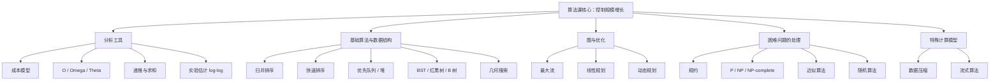
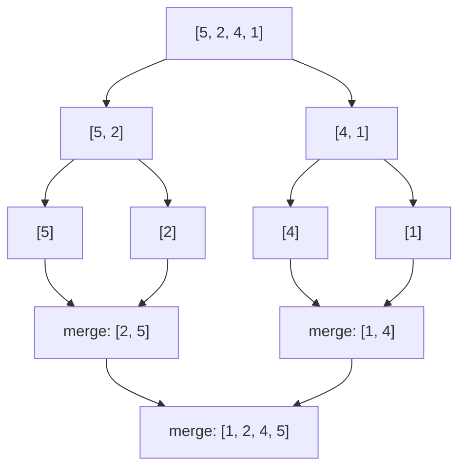
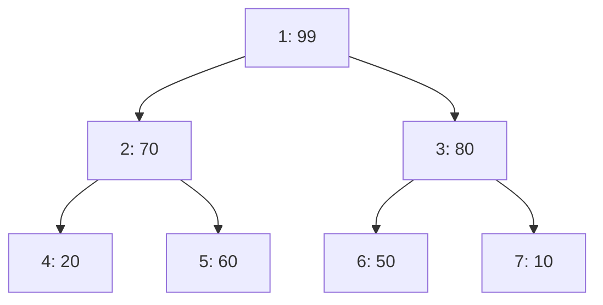
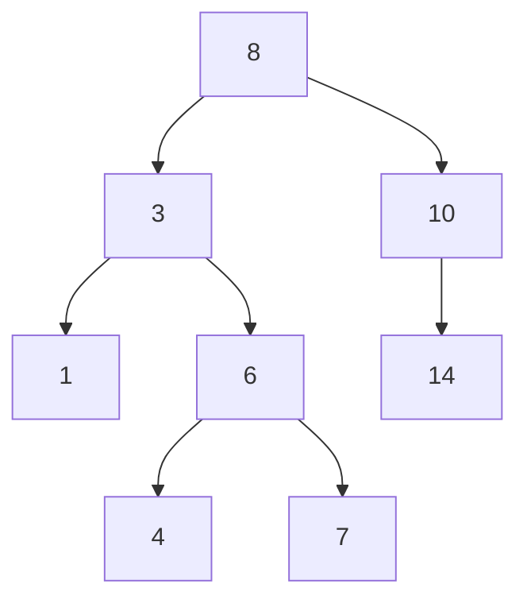
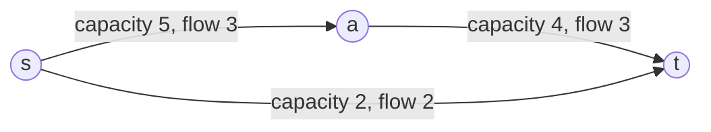
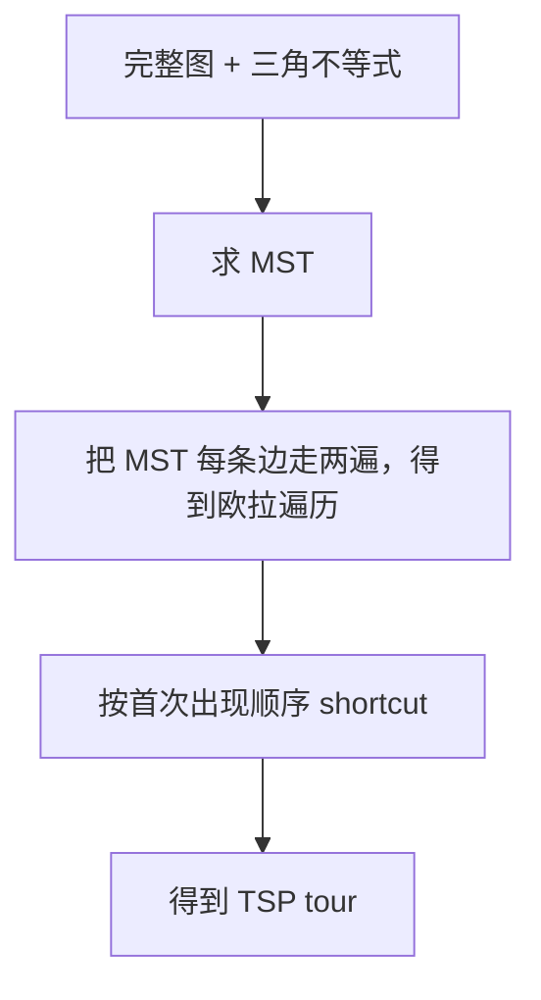
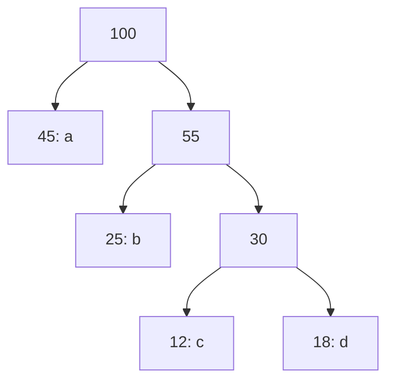

# 算法课复习讲义

> 这份讲义按当前目录下的 18 份课件整理。它不是逐页翻译，也不是只列公式，而是把课件里的算法主线、证明套路、代码模板和常考题型重新组织成一份可以连续阅读的复习材料。默认读者已经学过 C++ 和基础数据结构。

## 前言

算法课容易给人一种错觉：每一讲都是一个新名词，每个算法都有一套独立代码。实际上，它们围绕的是同一个问题：当输入规模变大时，怎样让计算仍然可控。

所以这份讲义按三层写：

1. **先看直觉。** 通过图解理解算法到底在移动什么、维护什么、剪掉什么。
2. **再看不变量和公式。** 例如归并排序每层合并量为 $N$，最大流靠残量网络表达“还能怎么调整”，动态规划靠状态定义固定依赖关系。
3. **最后看代码。** 代码只背模板不够，重点是知道变量的含义、循环顺序和边界为什么这样写。

如果只剩半天，读第 0 到 14 章；如果要补课，按第 15 章逐讲读；如果担心漏课件细节，最后用第 16 章对照检查。

## 阅读顺序与课件索引

可以按自己的时间选择路线：

| 时间 | 读法 |
|---|---|
| 30 分钟 | 只读第 14 章“考前压缩版清单”和第 12、13 章题型 |
| 2 小时 | 读第 0 到 10 章速查区，再扫第 11 章代码模板 |
| 半天以上 | 从图解索引开始，再按第 15 章逐讲细读 |

**Typora 公式约定**

- 行内公式使用 `$...$`，例如 `$O(n \log n)$`。
- 独立公式使用 `$$...$$`，例如：

$$
T(n)=2T(n/2)+n=\Theta(n\log n)
$$

**课件索引**

| PDF | 对应章节 | 关键词 |
|---|---|---|
| `1. AnalysisOfAlgorithms.pdf` | 0，15.1 | 成本模型、增长阶、log-log 实验、离散求和、内存 |
| `2. Mergesort.pdf` | 1，11，15.2 | 分治、合并、递推、稳定性、比较排序下界、Comparator |
| `3. Quicksort.pdf` | 1，11，15.3 | partition、随机打乱、Quickselect、三向切分、系统排序 |
| `4. PriorityQueues.pdf` | 1，11，15.4 | PQ API、堆、swim/sink、堆排序、事件驱动模拟 |
| `2. BinarySearchTrees.pdf` | 2，15.5 | BST、get/put、floor/rank/select、中序、Hibbard deletion |
| `3. BalancedSearchTrees.pdf` | 2，15.6 | 2-3 树、LLRB 红黑树、旋转、颜色翻转、B 树 |
| `1. GeometricSearch.pdf` | 3，15.7 | 1D 范围搜索、扫描线、kd-tree、区间树、矩形相交 |
| `2. MaxFlow.pdf` | 4，11，15.8 | 残量网络、增广路、最大流最小割、二分图匹配、棒球淘汰 |
| `2.DynamicProgramming.pdf` | 5，11，15.9 | Fibonacci、Floyd、LCS、无界背包、0/1 背包 |
| `1.Reductions.pdf` | 6，15.10 | 规约方向、算法设计、下界、凸包、复杂度分类 |
| `2.LinearProgramming.pdf` | 6，15.11 | LP 建模、brewer 问题、可行域、单纯形、maxflow LP |
| `1.Intractability.pdf` | 6，15.12 | Turing machine、P/NP、NP-complete、指数爆炸、应对策略 |
| `1.ApproximationAlgorithms_1.pdf` | 7，15.13 | 近似比、Vertex Cover、Metric TSP、Set Cover |
| `1.ApproximationAlgorithms_2.pdf` | 7，15.14 | 负载均衡、k-center、加权 VC、LP rounding、背包 FPTAS |
| `1.DataCompression.pdf` | 8，11，15.15 | RLE、前缀码、Huffman、LZW、无损压缩不可能性 |
| `2.RandomizedAlgorithms.pdf` | 9，15.16 | Karger、期望线性性、Max-3SAT、通用哈希、Chernoff |
| `2.StreamingAlgorithms.pdf` | 10，15.17 | 流模型、reservoir、priority sampling、Count-Min、FM |
| `2.StreamingAlgorithms-精简.pdf` | 10，15.17 | 流式算法精简总结、Bloom Filter、不同元素估计 |

## 图解索引

> Typora 打开 Mermaid 后，下列图会直接渲染；不渲染时也可以按代码块里的层级阅读。

### A. 课程知识地图



先抓主线：这门课不是一堆孤立算法，而是围绕同一个问题展开：当输入规模变大时，怎样让计算仍然可行。

### B. 复杂度增长直觉图

```text
输入规模 N 增大时：

log N      :  ▏▏▏
N          :  ▏▏▏▏▏▏▏▏
N log N    :  ▏▏▏▏▏▏▏▏▏▏
N^2        :  ▏▏▏▏▏▏▏▏▏▏▏▏▏▏▏▏▏▏▏▏
2^N        :  ▏▏▏▏▏▏▏▏▏▏▏▏▏▏▏▏▏▏▏▏▏▏▏▏▏▏▏▏▏▏▏▏...
N!         :  很快爆炸，通常只能处理很小 N
```

记成公式就是：

$$
\log N \ll N \ll N\log N \ll N^2 \ll N^3 \ll 2^N \ll N!
$$

常见陷阱：$N\log N$ 虽然比 $N$ 大，但远小于 $N^2$；指数级不是“慢一点”，而是规模稍大就彻底不可用。

### C. 归并排序：先拆再合



过程拆开看：

```text
原数组：         [5, 2, 4, 1]
拆成两半：       [5, 2]       [4, 1]
继续拆：         [5] [2]      [4] [1]
小段合并：       [2, 5]       [1, 4]
最终合并：       [1, 2, 4, 5]
```

再往里看：每一层合并总量都是 $N$，层数是 $\log_2N$，所以：

$$
T(N)=N\log_2N
$$

### D. 快速排序：一次 partition 定一个元素

```text
目标：选 pivot = 5，把小的放左边，大的放右边

初始：
[5 | 8  1  7  3  6  2]
 ^ pivot

partition 后：
[2  3  1 | 5 | 7  6  8]
          ^
          pivot 到达最终位置

递归处理左右：
[2 3 1] 和 [7 6 8]
```

双指针可视化：

```text
pivot = a[lo]

lo                 hi
 v                  v
[K, R, A, T, E, L, E]
    i           j

i 向右找 >= pivot 的元素
j 向左找 <= pivot 的元素
找到后交换，直到 i 和 j 交叉
最后 pivot 与 a[j] 交换
```

三向切分可视化：

```text
处理重复键：pivot = R

区间含义：
[ < R ][ = R ][ unknown ][ > R ]
  lo    lt     i        gt     hi

遇到小于 R：和 lt 交换，lt++，i++
遇到等于 R：i++
遇到大于 R：和 gt 交换，gt--
```

再往里看：三向切分让大量重复键的排序接近线性，因为等于 pivot 的一大段不会再递归。

### E. 堆：数组里的完全二叉树



对应数组，使用 1 下标：

```text
index:  1   2   3   4   5   6   7
value: 99  70  80  20  60  50  10

parent(k) = k / 2
left(k)   = 2k
right(k)  = 2k + 1
```

插入 `85` 的上浮过程：

```text
插入到末尾：
99 70 80 20 60 50 10 85
                  ^
                 新节点

85 > parent 20，交换：
99 70 80 85 60 50 10 20

85 > parent 70，交换：
99 85 80 70 60 50 10 20

85 < parent 99，停止。
```

### F. BST 与旋转：搜索路径是一串比较

BST 查找 `7`：



路径：

```text
7 < 8  => 去左
7 > 3  => 去右
7 > 6  => 去右
找到 7
```

左旋可视化，常用于红黑树修复“右红链接”：

```text
旋转前：                 旋转后：

    h                       x
     \                     / \
      x        ==>        h   C
     / \                   \
    B   C                   B
```

右旋可视化：

```text
旋转前：                 旋转后：

      h                   x
     /                   / \
    x        ==>        A   h
   / \                     /
  A   B                   B
```

再往里看：旋转不改变中序遍历结果，因此不破坏 BST 的有序性，只改变树高和局部平衡。

### G. kd-tree：用线切空间

```text
二维点集递归分割：

第 0 层：按 x 切
        |
        |
--------+--------
        |

第 1 层：左右子空间分别按 y 切

左子空间：        右子空间：
--------          --------
                  --------
```

最近邻剪枝图：

```text
query 点 q 当前最近距离为 r

        子矩形 R
    +-------------+
    |             |
    |             |
    +-------------+

如果 dist(q, R) >= r：
    R 里面任何点都不可能更近，整棵子树剪掉。
```

再往里看：kd-tree 的性能来自“矩形边界”剪枝，而不是单纯比较点坐标。

### H. 最大流：残量边表示“还能调整多少”



残量网络对应：

```text
原边 s -> a: capacity = 5, flow = 3

正向残量 s -> a = 5 - 3 = 2   表示还能再送 2
反向残量 a -> s = 3           表示最多能撤回 3
```

增广路过程：

```text
1. 在残量网络里找 s 到 t 的路径。
2. 取路径上最小残量，叫 bottleneck。
3. 沿正向边加流，沿反向边减流。
4. 找不到路径时，当前流就是最大流。
```

最大流最小割一眼图：

```text
割把点分成 A/B 两边：

 A side                 B side
 {s, ...}   --->        {..., t}

割容量 = 所有从 A 指向 B 的边容量之和

最大流值 = 最小割容量
```

### I. 动态规划：表格里的依赖关系

LCS 的依赖：

```text
如果 a[i-1] == b[j-1]：

       j-1    j
     +-----+-----+
i-1  |  ↘  |     |
     +-----+-----+
i    |     | dp  |
     +-----+-----+

dp[i][j] = dp[i-1][j-1] + 1

如果不相等：

       j-1    j
     +-----+-----+
i-1  |     |  ↑  |
     +-----+-----+
i    |  ←  | dp  |
     +-----+-----+

dp[i][j] = max(dp[i-1][j], dp[i][j-1])
```

0/1 背包倒序原因：

```text
当前物品 weight = 3, value = 5

倒序：
dp[10] 使用旧 dp[7]
dp[9]  使用旧 dp[6]
...
不会重复使用当前物品

正序会发生：
dp[3] 更新后，dp[6] 立刻可能用新的 dp[3]
等价于同一物品用了两次
```

### J. 规约：箭头方向决定证明含义


读法：

```text
X <=p Y
表示：会解 Y，就会解 X。
```

证明困难性的方向：


### K. 线性规划：可行域与最优点

二维 LP 可视化：

```text
目标：maximize  13A + 23B

B
^
|       feasible region
|        +------*
|       /      /
|      /      /
|     +------+
|
+-----------------> A

线性目标函数的等值线平行移动；
最后碰到可行域的某个顶点；
所以最优解可在极点取得。
```

再往里看：高维时可行域是凸多面体，单纯形法沿多面体边从一个极点走到另一个极点。

### L. 近似做法：Vertex Cover 2-approx

```text
图中选一条未覆盖边 (u, v)：

u ----- v

把 u 和 v 都放进 C。

为什么最多 2 倍？
每次选出的边之间互不相邻，构成一个匹配 M。
最优顶点覆盖必须至少为 M 中每条边选一个端点：

OPT >= |M|

算法为每条匹配边选两个端点：

ALG = 2|M| <= 2OPT
```

Metric TSP 2-approx：



关键不等式：

$$
cost(MST)\le OPT
$$

$$
cost(Euler)=2cost(MST)\le 2OPT
$$

shortcut 因三角不等式不会增加成本，所以：

$$
cost(ALG)\le 2OPT
$$

### M. Huffman：频率越高，路径越短



编码规则：

```text
左边记 0，右边记 1。

a: 0
b: 10
c: 110
d: 111
```

为什么前缀码能直接解码：

```text
读 bit 时从根走；
走到叶子就输出一个字符；
再回到根继续读。

因为没有任何字符编码是另一个字符编码的前缀，所以不会歧义。
```

### N. Bloom Filter：多个哈希函数点亮 bit

```text
bit array:
index: 0 1 2 3 4 5 6 7 8 9
bits : 0 1 0 0 1 0 1 0 0 0

插入 x：
h1(x)=1, h2(x)=4, h3(x)=6
把 1、4、6 置为 1

查询 y：
如果 h1(y), h2(y), h3(y) 对应 bit 全是 1 => 可能存在
只要有一个是 0 => 一定不存在
```

再往里看：假阳性概率近似：

$$
p=\left(1-e^{-kn/m}\right)^k
$$

最优哈希函数数量：

$$
k=\frac{m}{n}\ln 2
$$

### O. Reservoir Sampling：未知长度也能均匀抽样

以保留 1 个样本为例：

```text
第 1 个元素：必选
第 2 个元素：以 1/2 概率替换
第 3 个元素：以 1/3 概率替换
...
第 i 个元素：以 1/i 概率替换
```

为什么每个元素最后概率相同？

第 $j$ 个元素被留下：

$$
\frac{1}{j}\cdot\frac{j}{j+1}\cdot\frac{j+1}{j+2}\cdots\frac{n-1}{n}=\frac1n
$$

保留 $k$ 个样本时，第 $i$ 个元素以 $k/i$ 概率进入水塘。


## 0. 复杂度与分析


> 从这里到第 14 章是速查区。先把结论和模板过一遍；如果某个点不熟，再跳到第 15 章看对应课件讲义。

### 0.1 必背概念

| 记号 | 含义 | 常见用法 |
|---|---|---|
| `~ f(n)` | 只保留主项与常数系数 | 近似运行时间模型 |
| `O(f(n))` | 渐进上界 | 证明“不会超过” |
| `Ω(f(n))` | 渐进下界 | 证明“至少需要” |
| `Θ(f(n))` | 渐进同阶 | 精确分类 |

常见增长顺序：

`1 < log n < n < n log n < n^2 < n^3 < 2^n < n!`

分析套路：

1. 明确输入规模 `n`。
2. 选成本模型：比较次数、数组访问次数、边访问次数、内存字节数等。
3. 写出循环次数或递推式。
4. 去掉低阶项和常数，得到渐进复杂度。

常用结论：

| 场景 | 复杂度 |
|---|---|
| 二分查找 | `Θ(log n)` |
| 两层三角循环 `for i: for j<i` | `Θ(n^2)` |
| 归并排序递推 `T(n)=2T(n/2)+n` | `Θ(n log n)` |
| 堆建堆，自底向上 `sink` | `Θ(n)` |
| 暴力 TSP 枚举排列 | `Θ(n!)` |

## 1. 排序与优先队列

### 1.1 归并排序

核心：分治。先递归排序左右两半，再线性合并。

性质：

| 项 | 结论 |
|---|---|
| 时间 | 最好、平均、最坏均 `Θ(n log n)` |
| 空间 | 需要辅助数组 `Θ(n)` |
| 稳定性 | 稳定；相等时先取左边元素 |
| 适用 | 需要稳定排序、链表排序、外部排序 |

### 1.2 快速排序与选择

快速排序核心：随机打乱后选枢轴，把数组划分为 `< pivot` 和 `> pivot` 两边，再递归。

性质：

| 项 | 结论 |
|---|---|
| 平均时间 | `Θ(n log n)` |
| 最坏时间 | `Θ(n^2)`，随机化后概率很小 |
| 空间 | 原地，递归栈平均 `Θ(log n)` |
| 稳定性 | 不稳定 |
| 重复键很多 | 用三向切分 `<, =, >` |
| 第 k 小元素 | Quickselect，期望 `Θ(n)` |

三向切分快排指针语义：

`a[lo..lt-1] < v`，`a[lt..i-1] == v`，`a[i..gt] unknown`，`a[gt+1..hi] > v`。

### 1.3 优先队列与堆

二叉堆用数组表示完全二叉树。

若使用 1 下标：

| 节点 | 位置 |
|---|---|
| 父节点 | `k/2` |
| 左孩子 | `2k` |
| 右孩子 | `2k+1` |

最大堆不变量：父节点键值不小于孩子。

| 操作 | 复杂度 |
|---|---|
| `insert` + `swim` | `O(log n)` |
| `delMax` + `sink` | `O(log n)` |
| `max` | `O(1)` |
| 建堆 | `O(n)` |
| 堆排序 | `O(n log n)`，原地，不稳定 |

## 2. 符号表与搜索树

### 2.1 BST

二叉搜索树性质：任意节点 `x`，左子树所有键 `< x.key`，右子树所有键 `> x.key`。

常用操作：

| 操作 | 思路 |
|---|---|
| `get/put` | 按键比较，向左或向右递归 |
| `min/max` | 一直走左/右 |
| `floor(k)` | 小于等于 `k` 的最大键 |
| `ceiling(k)` | 大于等于 `k` 的最小键 |
| `rank(k)` | 小于 `k` 的键个数 |
| `select(i)` | 排名为 `i` 的键 |
| 中序遍历 | 输出升序序列 |

复杂度：随机插入平均 `Θ(log n)`，最坏退化为链表 `Θ(n)`。

删除：

| 情况 | 做法 |
|---|---|
| 0 个孩子 | 直接删除 |
| 1 个孩子 | 用孩子替换该节点 |
| 2 个孩子 | Hibbard deletion：用右子树最小节点替换 |

<figure class="case-figure">
<div class="mini-tree-lines"><span class="mini-edge">8</span><span class="mini-edge">3 ← left，10 → right</span><span class="mini-edge">1, 6, 14</span><span class="mini-edge">4, 7, 13</span></div>
<figcaption>BST 查询靠比较一路剪掉子树</figcaption>
</figure>

#### 经典例题：`floor`、`rank`、`select` 三件套

题面：BST 中键为 `{1,3,4,6,7,8,10,13,14}`，求 `floor(5)`、`rank(7)`、`select(4)`。

解析：`floor(5)` 是不超过 5 的最大键，因此答案是 4。`rank(7)` 是严格小于 7 的键数，`{1,3,4,6}` 共 4 个。`select(4)` 用 0 下标排名，第 4 个键是 7。代码上，`rank/select` 必须让每个节点维护子树大小 `size`，否则每次都重新数节点会退化。

易错点：`rank` 相等时返回的是左子树大小，不是当前子树大小；`floor` 走右子树失败时，当前节点才是候选答案。

<div class="case-clear"></div>

### 2.2 平衡搜索树

2-3 树允许节点存 1 个或 2 个键，所有叶子深度相同，因此操作为 `Θ(log n)`。

左倾红黑树是 2-3 树的二叉实现：

| 规则 | 含义 |
|---|---|
| 红链接左倾 | 右红链接要左旋 |
| 不允许连续红链接 | 出现左左红要右旋 |
| 完美黑平衡 | 每条根到空链接路径黑链接数相同 |
| 颜色翻转 | 临时 4-节点拆分 |

B 树：多路平衡搜索树，适合磁盘和数据库索引，目标是减少 I/O 次数。

## 3. 几何搜索

### 3.1 一维范围搜索

在有序符号表/BST 上支持：

| 查询 | 公式 |
|---|---|
| 区间枚举 `[lo, hi]` | 中序遍历时剪枝 |
| 区间计数 | `rank(hi) - rank(lo) + contains(hi)` |

### 3.2 扫描线

线段相交常用扫描线：

1. 按 `x` 坐标处理事件点。
2. 垂直线段到来时，在活动集合中查询 `y` 范围。
3. 水平线段左端点插入活动集合，右端点删除。

活动集合通常用平衡 BST。

### 3.3 kd-tree

二维 kd-tree 交替按 `x`、`y` 分割空间。

| 查询 | 剪枝依据 |
|---|---|
| 范围查询 | 子矩形与查询矩形不相交则剪掉 |
| 最近邻 | 子矩形到查询点的最小距离不优于当前答案则剪掉 |

平均较快，最坏仍可能退化。

### 3.4 区间搜索树

每个节点保存区间 `[lo, hi]`，按 `lo` 建 BST，并额外维护子树最大右端点 `maxHi`。

查找任意相交区间 `[qlo, qhi]`：

1. 当前节点相交则返回。
2. 若左子树存在且 `left.maxHi >= qlo`，去左子树。
3. 否则去右子树。

相交判定：`a.lo <= b.hi && b.lo <= a.hi`。

## 4. 最大流

### 4.1 基本定义

输入：有向图、源点 `s`、汇点 `t`、边容量 `c(e)`。

流必须满足：

| 约束 | 含义 |
|---|---|
| 容量约束 | `0 <= f(e) <= c(e)` |
| 流量守恒 | 除 `s,t` 外，入流等于出流 |

残量网络：

| 边 | 残量 |
|---|---|
| 正向边 | `c - f` |
| 反向边 | `f` |

Ford-Fulkerson：不断在残量网络中找增广路，把瓶颈容量加到路径上。

最大流最小割定理：

> 一个流是最大流，当且仅当残量网络中不存在从 `s` 到 `t` 的增广路；最大流值等于最小割容量。

常见复杂度：

| 算法 | 复杂度 |
|---|---|
| Ford-Fulkerson，整数容量 | `O(E * maxflow)` |
| Edmonds-Karp，BFS 找最短增广路 | `O(VE^2)` |
| Dinic | 常用模板，竞赛中更稳 |

应用：二分图匹配、棒球淘汰、图割、图像分割、项目选择。

## 5. 动态规划

### 5.1 通用步骤

1. 定义状态：`dp[...]` 表示什么。
2. 找最优子结构。
3. 写转移方程。
4. 初始化边界。
5. 确定计算顺序。
6. 如需输出方案，额外记录选择。

自顶向下：递归 + 记忆化。  
自底向上：表格迭代，通常更适合考试填空。

### 5.2 Floyd-Warshall

`d[k][i][j]` 表示只允许使用 `1..k` 作为中间点时，`i` 到 `j` 的最短路。

转移：

`d[i][j] = min(d[i][j], d[i][k] + d[k][j])`

复杂度：`O(n^3)` 时间，`O(n^2)` 空间。

### 5.3 LCS

`dp[i][j]` 表示 `a[:i]` 与 `b[:j]` 的最长公共子序列长度。

转移：

```text
if a[i-1] == b[j-1]:
    dp[i][j] = dp[i-1][j-1] + 1
else:
    dp[i][j] = max(dp[i-1][j], dp[i][j-1])
```

### 5.4 背包

0/1 背包：每件物品最多选一次。

`dp[x]` 表示容量为 `x` 时的最大价值，容量倒序枚举：

```text
for each item i:
    for x from W down to w[i]:
        dp[x] = max(dp[x], dp[x-w[i]] + v[i])
```

完全背包：每件物品可选无限次，容量正序枚举。

```text
for each item i:
    for x from w[i] to W:
        dp[x] = max(dp[x], dp[x-w[i]] + v[i])
```

## 6. 规约、线性规划与不可解性

### 6.1 规约

`X` 规约到 `Y`：如果有 `Y` 的算法，就能借它解决 `X`。

用途：

| 目标 | 说明 |
|---|---|
| 设计算法 | 把新问题转成已会的问题 |
| 证明下界 | 已知难问题规约到新问题 |
| 分类问题 | 判断问题属于 P、NP、NP-complete 等 |

注意方向：

若 `X <=p Y` 且 `Y` 有多项式算法，则 `X` 有多项式算法。  
若 `X` 已知很难且 `X <=p Y`，说明 `Y` 至少和 `X` 一样难。

### 6.2 线性规划

标准形式：

```text
maximize    c^T x
subject to  A x <= b
            x >= 0
```

基本事实：

| 概念 | 说明 |
|---|---|
| 可行域 | 半空间交，凸多面体 |
| 最优解 | 若有界且存在，某个极点上存在最优解 |
| 松弛变量 | 把不等式变成等式 |
| 单纯形法 | 沿极点移动，做 pivot |
| LP 规约 | 最短路、最大流、匹配等可写成 LP |

### 6.3 P、NP、NP-complete

| 类 | 含义 |
|---|---|
| P | 多项式时间可解 |
| NP | 给定证书后可多项式时间验证 |
| NP-hard | 至少和 NP 中任意问题一样难 |
| NP-complete | 同时属于 NP 且 NP-hard |

证明一个问题 NP-complete：

1. 证明它在 NP 中。
2. 找一个已知 NP-complete 问题 `A`。
3. 构造多项式规约 `A <=p B`。

应对 NP-hard 优化问题：

| 放弃点 | 方法 |
|---|---|
| 放弃最优 | 近似算法 |
| 放弃任意实例 | 特殊情况算法 |
| 放弃多项式时间 | 指数搜索、分支限界 |

<figure class="case-figure">
<div class="viz-flow"><div class="viz-card"><strong>已知难</strong>SAT</div><div class="viz-card"><strong>规约</strong>SAT ≤p B</div><div class="viz-card"><strong>结论</strong>B 也难</div></div>
<figcaption>证明 NP-complete 的方向不能反</figcaption>
</figure>

#### 经典例题：证明一个新判定问题是 NP-complete

题面：给出一个新问题 `B`，要求证明它是 NP-complete。标准答案应该写哪些步骤？

解析：第一步证明 `B ∈ NP`：给定一个候选解，可以在多项式时间验证。第二步选一个已知 NP-complete 问题 `A`，构造多项式时间变换，把 `A` 的任意实例变成 `B` 的实例，并证明答案保持等价。方向必须是 `A <=p B`，意思是“如果会解 B，就会解已知困难的 A”，所以 B 至少和 A 一样难。

易错点：写成 `B <=p A` 只能说明 B 不比 A 难，不能证明 B 难。考试里规约方向通常就是扣分点。

<div class="case-clear"></div>

## 7. 近似算法

### 7.1 近似比

最小化问题：算法解 `ALG <= ρ * OPT`。  
最大化问题：算法解 `ALG >= OPT / ρ`。

近似算法三件事：

1. 解必须可行。
2. 算法必须多项式时间。
3. 必须证明近似比。

### 7.2 高频模型

| 问题 | 算法 | 近似比 | 关键证明 |
|---|---|---|---|
| Vertex Cover | 反复取一条未覆盖边，把两个端点都加入 | 2 | 取到的边构成匹配，最优至少覆盖每条匹配边 |
| Metric TSP | MST 先序遍历并 shortcut | 2 | `MST <= OPT`，欧拉遍历 `2*MST`，三角不等式 shortcut 不增 |
| Set Cover | 每次选单位新增覆盖成本最低的集合 | `H_n ≈ ln n` | 价格分摊 |
| Load Balancing | List scheduling | 2 或 `2-1/m` | 与最大作业、平均负载两个下界比较 |
| LPT 调度 | 作业从大到小再 list scheduling | 约 `4/3` | 大作业先放降低瓶颈 |
| k-center | 每次选离已有中心最远的点 | 2 | 鸽巢与三角不等式 |
| Weighted Vertex Cover | LP rounding：`x_v >= 1/2` 的点取入 | 2 | LP 最优是整数最优下界 |
| Knapsack | 缩放价值做 DP | FPTAS | 精度 `ε` 控制损失 |

## 8. 数据压缩

### 8.1 基本结论

无损压缩不能压缩所有文件：因为短串数量少于长串数量，鸽巢原理决定必有文件无法变短。

| 方法 | 核心 |
|---|---|
| RLE | 连续重复字符用“字符 + 次数”表示 |
| Huffman | 高频字符用短码，低频字符用长码 |
| LZW | 动态建立字符串字典，输出最长前缀的编号 |

### 8.2 Huffman

步骤：

1. 统计字符频率。
2. 每个字符建叶子节点，放入最小堆。
3. 反复取频率最小的两个节点合并。
4. 左边记 `0`，右边记 `1`，得到前缀码。

性质：对给定频率的字符编码，Huffman 是最优前缀码。

### 8.3 LZW

压缩：

1. 字典初始化为所有单字符。
2. 每次找输入的最长字典前缀 `s`。
3. 输出 `code(s)`。
4. 把 `s + next_char` 加入字典。

解压同步构造同一个字典。

## 9. 随机算法

### 9.1 类型

| 类型 | 正确性 | 时间 |
|---|---|---|
| Las Vegas | 一定正确 | 随机，分析期望时间 |
| Monte Carlo | 允许小概率错误 | 通常固定上界 |

### 9.2 常见结论

| 主题 | 结论 |
|---|---|
| 随机快排 | 期望 `O(n log n)` |
| Karger 最小割 | 单次成功概率至少 `2/(n(n-1))`，重复可放大 |
| 期望线性性 | 不要求随机变量独立 |
| Max-3SAT 随机赋值 | 每个 3-CNF 子句满足概率 `7/8` |
| 通用哈希 | 随机选哈希函数，控制碰撞概率 |
| Chernoff bound | 独立 0/1 变量和偏离期望的概率指数下降 |

<figure class="case-figure">
<div class="mini-network"><span class="mini-edge">随机选边</span><span class="mini-edge">收缩两个端点</span><span class="mini-edge">直到剩 2 个超点</span></div>
<figcaption>Karger：不收缩最小割边就可能成功</figcaption>
</figure>

#### 经典例题：Karger 随机收缩求最小割

题面：无向多重图中随机选边并收缩，直到只剩两个超点，剩下跨越两边的边数就是一个割。为什么重复多次可以找到最小割？

解析：如果某次运行从头到尾都没有收缩到某个固定最小割上的边，那么这个最小割会完整保留下来，最后输出它。单次成功概率至少为 `2/(n(n-1))`，不算高，但独立重复后失败概率会指数下降。它是 Monte Carlo 风格：时间可控，但单次结果可能不是最优割。

易错点：Karger 输出的一定是一个合法割，但不一定是最小割；正确性依赖重复放大成功概率。

<div class="case-clear"></div>

## 10. 流式算法

### 10.1 模型

输入只能按流顺序看一遍或少数几遍，内存远小于数据规模。

| 模型 | 说明 |
|---|---|
| Time-series | 每个位置更新一次 |
| Cash-register | 只增加计数，`c[x] > 0` |
| Turnstile | 可增加也可减少 |

### 10.2 Sampling 与 Sketching

Sampling：只保留被抽中的元素。  
Sketching：每个元素都“看见”，但只更新小摘要。

### 10.3 Reservoir Sampling

从未知长度流中等概率保留 `k` 个样本：

第 `i` 个元素到来时：

1. 若 `i <= k`，直接放入水塘。
2. 否则以概率 `k/i` 选中它。
3. 若选中，随机替换水塘中一个旧元素。

最终每个元素被保留概率都是 `k/n`。

### 10.4 Bloom Filter

用于集合成员测试，可能假阳性，不会假阴性。

参数：`m` 个 bit，`n` 个元素，`k` 个哈希函数。

假阳性概率近似：

`(1 - e^{-kn/m})^k`

最优哈希函数个数：

`k = (m/n) ln 2`

<figure class="case-figure">
<div class="bitset"><span class="cell off">0</span><span class="cell on">1</span><span class="cell off">2</span><span class="cell off">3</span><span class="cell on">4</span><span class="cell off">5</span><span class="cell on">6</span><span class="cell off">7</span><span class="cell off">8</span><span class="cell off">9</span></div>
<figcaption>Bloom Filter：三个哈希位全为 1 才回答“可能存在”</figcaption>
</figure>

#### 经典例题：Bloom Filter 为什么不会假阴性

题面：一个元素 `x` 插入时把 `h1(x),h2(x),h3(x)` 对应 bit 置为 1。查询 `x` 时发现其中某一位是 0，能否断定 `x` 不存在？

解析：能。只要 `x` 曾经插入过，它的所有哈希位都会被置 1，而且 Bloom Filter 没有删除操作时不会把 1 改回 0。因此出现任意一个 0，说明它没被插入过。相反，如果所有位都是 1，只能回答“可能存在”，因为这些 1 可能由其他元素共同造成。

易错点：Bloom Filter 的错误方向只有假阳性，没有假阴性；带删除的 Counting Bloom Filter 是另一个模型。

<div class="case-clear"></div>

### 10.5 估计不同元素个数

Flajolet-Martin 思想：

1. 哈希每个元素得到二进制串。
2. 记录最大尾随零个数 `R`。
3. 估计不同元素数约为 `2^R`，实际使用多个哈希函数降方差。

## 11. 经典例题与 C++ / Python 模板

这一章的目标不是让你把整段代码背下来，而是把每段模板拆成“状态、转移/维护、边界、复杂度”四件事。考试代码填空通常不会让你从零写完算法，而会挖掉下面这些位置：

| 会被挖的位置 | 你要先问自己的问题 |
|---|---|
| 循环边界 | 区间是闭区间 `[l,r]` 还是半开区间 `[l,r)`？数组是 0 下标还是 1 下标？ |
| 比较符号 | 相等时应该往哪边走？这通常决定稳定性、重复键处理或旋转方向。 |
| 状态转移 | 当前状态来自哪个旧状态？能不能包含“本轮刚更新”的值？ |
| 维护语句 | 结构被改变以后，辅助量是否同步更新，例如 `size`、`maxHi`、残量反向边。 |
| 返回值 | 返回的是下标、值、指针、布尔可达性，还是累计答案。 |

### 11.1 归并排序：排序并统计逆序对

<figure class="case-figure">
<div class="array-row"><span class="cell hot">2</span><span class="cell hot">4</span><span class="cell pivot">1</span><span class="cell">3</span><span class="cell">5</span></div>
<p class="mini-caption">右半段的 1 先出，左半段剩余 2、4 都和它构成逆序对。</p>
<div class="array-row"><span class="cell on">1</span><span class="cell">2</span><span class="cell">3</span><span class="cell">4</span><span class="cell">5</span></div>
<figcaption>归并时顺手统计跨左右两段的逆序对</figcaption>
</figure>

#### 经典例题：数组中的逆序对

题面：给定数组 `[2,4,1,3,5]`，统计有多少对 `(i,j)` 满足 `i<j` 且 `a[i]>a[j]`。

解析：暴力枚举两层循环是 `O(n^2)`。归并排序天然把问题拆成三块：左半内部逆序对、右半内部逆序对、跨左右两半的逆序对。左右两半排好序后，只要右半元素 `a[j]` 比左半当前元素 `a[i]` 小，左半剩余 `a[i..m)` 都比它大，所以一次加 `m-i`。例子中逆序对是 `(2,1)、(4,1)、(4,3)`，答案为 `3`。

代码重点：半开区间 `[l,r)` 减少边界错误；合并相等元素时用 `<=` 先取左边，排序稳定；辅助数组只分配一次，递归中复用。

复杂度：时间 `O(n log n)`，空间 `O(n)`。

<div class="case-clear"></div>

```cpp
#include <bits/stdc++.h>
using namespace std;

long long mergeSort(vector<int>& a, vector<int>& tmp, int l, int r) {
    if (r - l <= 1) return 0;
    int m = l + (r - l) / 2;
    long long inv = mergeSort(a, tmp, l, m) + mergeSort(a, tmp, m, r);
    int i = l, j = m, k = l;
    while (i < m || j < r) {
        if (j == r || (i < m && a[i] <= a[j])) {
            tmp[k++] = a[i++];
        } else {
            tmp[k++] = a[j++];
            inv += m - i;
        }
    }
    for (int p = l; p < r; ++p) a[p] = tmp[p];
    return inv;
}

int main() {
    vector<int> a = {2, 4, 1, 3, 5};
    vector<int> tmp(a.size());
    cout << mergeSort(a, tmp, 0, (int)a.size()) << "\n";
}
```

```python
def sort_count(a):
    if len(a) <= 1:
        return a[:], 0
    mid = len(a) // 2
    left, inv_l = sort_count(a[:mid])
    right, inv_r = sort_count(a[mid:])
    i = j = inv = 0
    out = []
    while i < len(left) or j < len(right):
        if j == len(right) or (i < len(left) and left[i] <= right[j]):
            out.append(left[i])
            i += 1
        else:
            out.append(right[j])
            inv += len(left) - i
            j += 1
    return out, inv_l + inv_r + inv

print(sort_count([2, 4, 1, 3, 5])[1])
```

#### 代码读法与考点

| 抓手 | 说明 |
|---|---|
| 区间约定 | C++ 版本使用半开区间 `[l,r)`，所以长度是 `r-l`，递归终点是 `r-l<=1`。半开区间的好处是左右段正好是 `[l,m)` 与 `[m,r)`，不会出现 `m+1` 的边界混乱。 |
| 变量含义 | `i` 扫左段，`j` 扫右段，`k` 写入 `tmp`；`inv` 保存左右子问题内部逆序对，加上合并时发现的跨段逆序对。 |
| 循环不变量 | 每次循环前，`tmp[l..k)` 已经有序，并且正好由 `a[l..i)` 和 `a[m..j)` 合并得到。 |
| 逆序对公式 | 当 `a[j] < a[i]` 且右段元素先出时，左段剩余 `a[i..m)` 全都大于 `a[j]`，所以一次增加 `m-i`。 |
| 稳定性 | 比较处必须写 `a[i] <= a[j]`。相等时先拿左段元素，原始相对次序不会被反转。 |
| 复杂度 | 每层合并总工作量 `O(n)`，层数 `O(log n)`，总时间 `O(n log n)`；辅助数组 `tmp` 占 `O(n)`。 |
| 高频填空点 | `r-l<=1`、`a[i] <= a[j]`、`inv += m-i`、复制回 `a[p]=tmp[p]`。 |

### 11.2 Quickselect：第 k 小元素，0 下标

<figure class="case-figure">
<div class="array-row"><span class="cell">7</span><span class="cell hot">2</span><span class="cell">9</span><span class="cell pivot">5</span><span class="cell">8</span><span class="cell hot">1</span><span class="cell">6</span></div>
<p class="mini-caption">partition 后 pivot=5 到最终位置；只保留包含第 k 小的一侧。</p>
<div class="array-row"><span class="cell hot">2</span><span class="cell hot">1</span><span class="cell pivot">5</span><span class="cell">7</span><span class="cell">8</span><span class="cell">9</span><span class="cell">6</span></div>
<figcaption>Quickselect 每轮只递归一边</figcaption>
</figure>

#### 经典例题：找无序数组第 4 小

题面：给定 `[7,2,9,5,8,1,6]`，要求返回第 4 小元素。若使用 0 下标排名，就是 `k=3`。

解析：完整排序能做，但代价是 `O(n log n)`。Quickselect 只需要知道第 `k` 个元素最终落在哪里。一次 partition 后，pivot 左边都比它小，右边都不小；如果 pivot 的下标正好是 `k`，答案就是 pivot；如果下标小于 `k`，丢掉左边；否则丢掉右边。它和快排的区别是：快排两边都递归，Quickselect 只处理一边。

代码重点：先随机选 pivot，降低被特殊输入卡成 `O(n^2)` 的概率；`k` 必须统一成 0 下标；返回的是元素值，不是排名。

复杂度：期望 `O(n)`，最坏 `O(n^2)`。

<div class="case-clear"></div>

```cpp
#include <bits/stdc++.h>
using namespace std;

int quickselect(vector<int>& a, int k) {
    mt19937 rng((unsigned)chrono::steady_clock::now().time_since_epoch().count());
    int l = 0, r = (int)a.size() - 1;
    while (l <= r) {
        int p = uniform_int_distribution<int>(l, r)(rng);
        swap(a[p], a[r]);
        int i = l;
        for (int j = l; j < r; ++j) {
            if (a[j] < a[r]) swap(a[i++], a[j]);
        }
        swap(a[i], a[r]);
        if (i == k) return a[i];
        if (i < k) l = i + 1;
        else r = i - 1;
    }
    throw runtime_error("bad k");
}
```

```python
import random

def quickselect(a, k):
    l, r = 0, len(a) - 1
    while l <= r:
        p = random.randint(l, r)
        a[p], a[r] = a[r], a[p]
        i = l
        for j in range(l, r):
            if a[j] < a[r]:
                a[i], a[j] = a[j], a[i]
                i += 1
        a[i], a[r] = a[r], a[i]
        if i == k:
            return a[i]
        if i < k:
            l = i + 1
        else:
            r = i - 1
    raise ValueError("bad k")
```

#### 代码读法与考点

| 抓手 | 说明 |
|---|---|
| 问题含义 | `k` 是 0 下标排名：`k=0` 是最小值，`k=n-1` 是最大值。不要把它和“第 k 个”这种 1 下标说法混在一起。 |
| partition 不变量 | 扫描 `j` 时，`a[l..i)` 都小于 pivot，`a[i..j)` 都大于等于 pivot，`a[j..r)` 未处理，pivot 暂存在 `a[r]`。 |
| 为什么能丢一半 | pivot 交换到 `i` 后，`i` 就是它在当前子数组中的最终排名。如果 `i<k`，答案只能在右边；如果 `i>k`，答案只能在左边。 |
| 随机化作用 | 随机选 pivot 不改变最坏情况仍可能 `O(n^2)`，但期望切分足够平衡，期望时间 `O(n)`。 |
| 重复键提醒 | 这里是二向 partition，重复元素多时仍能正确，但可能退化得更明显；若题目强调重复键，优先考虑三向切分。 |
| 高频填空点 | `swap(a[p], a[r])`、`if (a[j] < a[r])`、`swap(a[i], a[r])`、`if (i < k) l=i+1`。 |

### 11.3 堆：前 k 大元素

<figure class="case-figure">
<div class="array-row"><span class="cell">5</span><span class="cell">1</span><span class="cell on">9</span><span class="cell">3</span><span class="cell on">7</span><span class="cell on">8</span></div>
<p class="mini-caption">维护大小为 3 的小根堆，堆顶是当前答案里的最小值。</p>
<div class="array-row"><span class="cell pivot">7</span><span class="cell">8</span><span class="cell">9</span></div>
<figcaption>Top-K 用“小根堆守门”</figcaption>
</figure>

#### 经典例题：数据流中保留前 3 大

题面：数字依次到来 `5,1,9,3,7,8`，只允许额外保存 `k=3` 个数，输出前 3 大。

解析：如果每来一个数都重新排序，代价太高。小根堆的堆顶是当前前 `k` 大里的最小者，也就是门槛。新数小于等于堆顶，说明它进不了前 `k`；新数大于堆顶，就替换堆顶。处理完后堆中是 `{7,8,9}`。

代码重点：C++ 用 `priority_queue<int, vector<int>, greater<int>>`；Python 的 `heapq` 默认就是小根堆；最后为了展示从大到小，需要再排序输出。

复杂度：处理 `n` 个元素是 `O(n log k)`，空间 `O(k)`。

<div class="case-clear"></div>

```cpp
#include <bits/stdc++.h>
using namespace std;

vector<int> topK(const vector<int>& a, int k) {
    priority_queue<int, vector<int>, greater<int>> pq;
    for (int x : a) {
        if ((int)pq.size() < k) pq.push(x);
        else if (x > pq.top()) {
            pq.pop();
            pq.push(x);
        }
    }
    vector<int> ans;
    while (!pq.empty()) {
        ans.push_back(pq.top());
        pq.pop();
    }
    sort(ans.rbegin(), ans.rend());
    return ans;
}
```

```python
import heapq

def top_k(a, k):
    heap = []
    for x in a:
        if len(heap) < k:
            heapq.heappush(heap, x)
        elif x > heap[0]:
            heapq.heapreplace(heap, x)
    return sorted(heap, reverse=True)
```

#### 代码读法与考点

| 抓手 | 说明 |
|---|---|
| 为什么用小根堆 | 堆里只保留目前最大的 `k` 个数。堆顶是这 `k` 个数里最小的，也就是“守门员”：新数只有比堆顶大，才有资格进入答案。 |
| 不变量 | 处理完前若干个元素后，`heap` 恰好保存这些元素中的前 `k` 大；若元素数不足 `k`，堆保存全部已处理元素。 |
| 更新规则 | 堆未满直接插入；堆满且 `x > heap[0]` 时，用 `x` 替换堆顶；否则丢弃 `x`。 |
| 为什么不是大根堆 | 大根堆适合反复取最大；这里需要随时淘汰“当前前 k 大中的最小者”，所以用小根堆。 |
| 复杂度 | 每个元素最多一次堆操作，堆大小不超过 `k`，总时间 `O(n log k)`，空间 `O(k)`。 |
| 高频填空点 | `greater<int>`、`pq.size()<k`、`x>pq.top()`、`heapq.heapreplace`。 |

### 11.4 几何：凸包 Andrew/Graham 思想

<figure class="case-figure">
<div style="position:relative;height:118px;border:1px solid #dbe4ee;border-radius:12px;background:white"><span class="point" style="left:12%;top:64%"></span><span class="point" style="left:26%;top:22%"></span><span class="point hot" style="left:47%;top:54%"></span><span class="point" style="left:70%;top:18%"></span><span class="point" style="left:82%;top:72%"></span><span style="position:absolute;left:12%;top:20%;width:72%;height:54%;border:2px solid #315f8c;border-radius:44% 38% 42% 40%;transform:rotate(-5deg)"></span></div>
<figcaption>凸包只保留最外层极点，中间点会被弹出</figcaption>
</figure>

#### 经典例题：围住所有点的最短橡皮筋

题面：给定平面点集，输出按逆时针顺序排列的凸包顶点。凸包可以理解为一根橡皮筋从外面绷紧后碰到的点。

解析：Andrew 算法先按 `x`、再按 `y` 排序。构造下凸壳时，从左到右扫描；每加入一个点，都检查最后三个点是否保持左转。如果出现右转，说明中间那个点凹进去了，不可能是凸包顶点，弹出。上凸壳同理反向扫描。

代码重点：叉积 `cross(a,b,c)` 的符号决定转向；`<=0` 会删除共线中间点，`<0` 会保留边界共线点；题目如果强调“所有边界点都输出”，比较符号要改。

复杂度：排序 `O(n log n)`，扫描 `O(n)`。

<div class="case-clear"></div>

```cpp
#include <bits/stdc++.h>
using namespace std;

struct P {
    long long x, y;
    bool operator<(const P& o) const {
        return x == o.x ? y < o.y : x < o.x;
    }
};

long long cross(const P& a, const P& b, const P& c) {
    return (b.x - a.x) * (c.y - a.y) - (b.y - a.y) * (c.x - a.x);
}

vector<P> convexHull(vector<P> p) {
    sort(p.begin(), p.end());
    p.erase(unique(p.begin(), p.end(), [](const P& a, const P& b) {
        return a.x == b.x && a.y == b.y;
    }), p.end());
    if (p.size() <= 1) return p;
    vector<P> h;
    for (auto q : p) {
        while (h.size() >= 2 && cross(h[h.size()-2], h.back(), q) <= 0) h.pop_back();
        h.push_back(q);
    }
    int lower = h.size();
    for (int i = (int)p.size() - 2; i >= 0; --i) {
        P q = p[i];
        while ((int)h.size() > lower && cross(h[h.size()-2], h.back(), q) <= 0) h.pop_back();
        h.push_back(q);
    }
    h.pop_back();
    return h;
}
```

```python
def cross(a, b, c):
    return (b[0] - a[0]) * (c[1] - a[1]) - (b[1] - a[1]) * (c[0] - a[0])

def convex_hull(points):
    pts = sorted(set(points))
    if len(pts) <= 1:
        return pts
    lower = []
    for p in pts:
        while len(lower) >= 2 and cross(lower[-2], lower[-1], p) <= 0:
            lower.pop()
        lower.append(p)
    upper = []
    for p in reversed(pts):
        while len(upper) >= 2 and cross(upper[-2], upper[-1], p) <= 0:
            upper.pop()
        upper.append(p)
    return lower[:-1] + upper[:-1]
```

#### 代码读法与考点

| 抓手 | 说明 |
|---|---|
| 核心判断 | `cross(a,b,c)>0` 表示从 `a->b` 到 `b->c` 是逆时针左转；`<0` 是右转；`=0` 是三点共线。 |
| Andrew 思路 | 先按 `(x,y)` 排序，再分别构造下凸壳和上凸壳。每加入一个新点，就删除会造成“非左转”的尾部点。 |
| `<=0` 的含义 | 当前代码会弹出右转和共线点，因此最终凸包不保留边上的共线中间点。若题目要求保留边界共线点，通常改成 `<0`。 |
| 不变量 | `lower` 始终是已扫描点集的下凸壳；删除尾点是因为它被新点和倒数第二个点“遮住”，不可能成为极点。 |
| 去重必要性 | 重复点会让共线判断和首尾拼接变乱，排序后先 `unique` / `set` 更稳。 |
| 复杂度 | 排序 `O(n log n)`，每个点最多入栈出栈一次，扫描 `O(n)`，总时间 `O(n log n)`。 |
| 高频填空点 | 叉积公式、排序去重、`while size>=2 && cross(...) <= 0`、最后去掉重复首点。 |

### 11.5 最大流：Dinic

<figure class="case-figure">
<div class="mini-network"><span class="mini-edge">s → a : 3</span><span class="mini-edge">s → b : 2</span><span class="mini-edge">a → b : 1</span><span class="mini-edge">a → t : 2</span><span class="mini-edge">b → t : 3</span></div>
<figcaption>最大流小图：答案为 5，瓶颈在源点总出边容量</figcaption>
</figure>

#### 经典例题：从源点到汇点最多能送多少流

题面：网络边容量为 `s->a=3, s->b=2, a->b=1, a->t=2, b->t=3`，求从 `s` 到 `t` 的最大流。

解析：源点总出边容量是 `3+2=5`，因此任何流都不可能超过 5。可以构造一组达到 5 的流：`s->a->t` 送 2，`s->b->t` 送 2，`s->a->b->t` 再送 1。上界可达，所以最大流为 5。Dinic 不需要你手工猜路径，它反复在残量网络中建分层图，并在分层图里找阻塞流。

代码重点：每条边必须有反向边；推流后正向残量减少、反向残量增加；BFS 只走残量大于 0 的边；DFS 只走下一层边。

复杂度：理论复杂度依图类而定，考试和工程实现重点是残量更新正确、当前弧不重复扫失败边。

<div class="case-clear"></div>

```cpp
#include <bits/stdc++.h>
using namespace std;

struct Dinic {
    struct Edge { int to, rev; long long cap; };
    int n;
    vector<vector<Edge>> g;
    vector<int> level, it;

    Dinic(int n) : n(n), g(n), level(n), it(n) {}

    void addEdge(int v, int to, long long cap) {
        Edge a{to, (int)g[to].size(), cap};
        Edge b{v, (int)g[v].size(), 0};
        g[v].push_back(a);
        g[to].push_back(b);
    }

    bool bfs(int s, int t) {
        fill(level.begin(), level.end(), -1);
        queue<int> q;
        level[s] = 0;
        q.push(s);
        while (!q.empty()) {
            int v = q.front(); q.pop();
            for (auto& e : g[v]) {
                if (e.cap > 0 && level[e.to] < 0) {
                    level[e.to] = level[v] + 1;
                    q.push(e.to);
                }
            }
        }
        return level[t] >= 0;
    }

    long long dfs(int v, int t, long long f) {
        if (v == t) return f;
        for (int& i = it[v]; i < (int)g[v].size(); ++i) {
            Edge& e = g[v][i];
            if (e.cap > 0 && level[e.to] == level[v] + 1) {
                long long ret = dfs(e.to, t, min(f, e.cap));
                if (ret > 0) {
                    e.cap -= ret;
                    g[e.to][e.rev].cap += ret;
                    return ret;
                }
            }
        }
        return 0;
    }

    long long maxflow(int s, int t) {
        long long flow = 0, INF = (1LL << 60);
        while (bfs(s, t)) {
            fill(it.begin(), it.end(), 0);
            while (long long f = dfs(s, t, INF)) flow += f;
        }
        return flow;
    }
};
```

```python
from collections import deque

class Dinic:
    def __init__(self, n):
        self.n = n
        self.g = [[] for _ in range(n)]

    def add_edge(self, v, to, cap):
        self.g[v].append([to, cap, len(self.g[to])])
        self.g[to].append([v, 0, len(self.g[v]) - 1])

    def bfs(self, s, t):
        self.level = [-1] * self.n
        self.level[s] = 0
        q = deque([s])
        while q:
            v = q.popleft()
            for to, cap, _ in self.g[v]:
                if cap > 0 and self.level[to] < 0:
                    self.level[to] = self.level[v] + 1
                    q.append(to)
        return self.level[t] >= 0

    def dfs(self, v, t, f):
        if v == t:
            return f
        while self.it[v] < len(self.g[v]):
            i = self.it[v]
            to, cap, rev = self.g[v][i]
            if cap > 0 and self.level[to] == self.level[v] + 1:
                ret = self.dfs(to, t, min(f, cap))
                if ret:
                    self.g[v][i][1] -= ret
                    self.g[to][rev][1] += ret
                    return ret
            self.it[v] += 1
        return 0

    def maxflow(self, s, t):
        flow = 0
        INF = 10**30
        while self.bfs(s, t):
            self.it = [0] * self.n
            while True:
                f = self.dfs(s, t, INF)
                if not f:
                    break
                flow += f
        return flow
```

#### 代码读法与考点

| 抓手 | 说明 |
|---|---|
| 残量网络 | `cap` 不是原始容量，而是当前还能再推多少流。每条正向边都配一条反向边，反向残量表示“可以撤销多少之前推过的流”。 |
| `rev` 的作用 | `rev` 记录反向边在邻接表中的下标，更新时可以 `O(1)` 找回配对边。没有 `rev`，残量更新会很容易写错。 |
| BFS 分层 | `level[v]` 是从源点按残量边走到 `v` 的层数。DFS 只走 `level[to]==level[v]+1` 的边，避免在残量网络里乱绕。 |
| DFS 当前弧 | `it[v]` 记住 `v` 的邻接表已经试到哪里。失败的边下次不再重复尝试，这是 Dinic 高效的关键细节之一。 |
| 增广更新 | 推出 `ret` 后，正向边 `cap -= ret`，反向边 `cap += ret`。这不是“多加了一条边”，而是允许后续算法取消这部分流量。 |
| 终止条件 | 当 BFS 无法到达汇点时，残量网络不存在增广路，当前流就是最大流；这和最大流最小割定理相连。 |
| 高频填空点 | `level[e.to] < 0`、`level[to]==level[v]+1`、`min(f, cap)`、`g[to][rev][1] += ret`、每轮 BFS 后重置 `it`。 |

### 11.6 动态规划：LCS 与 0/1 背包

<figure class="case-figure">
<div class="array-row"><span class="cell">A</span><span class="cell hot">B</span><span class="cell">C</span><span class="cell hot">B</span><span class="cell">D</span><span class="cell hot">A</span><span class="cell hot">B</span></div>
<div class="array-row" style="margin-top:.35rem"><span class="cell hot">B</span><span class="cell">D</span><span class="cell hot">C</span><span class="cell hot">A</span><span class="cell hot">B</span><span class="cell">A</span></div>
<figcaption>LCS 例子：ABCBDAB 与 BDCABA 的长度为 4</figcaption>
</figure>

#### 经典例题：最长公共子序列和背包选物品

题面 A：求 `ABCBDAB` 与 `BDCABA` 的 LCS 长度。题面 B：容量 `W=5`，物品 `(w,v)=(2,3),(3,4),(4,5)`，求 0/1 背包最大价值。

解析：LCS 的关键是状态定义：`dp[i][j]` 只看两个前缀，最后一个字符相等就来自左上角加一，否则来自上方或左方最大值。背包的关键也是状态定义：`dp[x]` 是当前处理过若干物品、容量不超过 `x` 的最大价值。题面 B 中选重量 2 和 3 的两件物品，价值为 7，是最优。

代码重点：LCS 用 `i-1`、`j-1` 访问字符，用 `i`、`j` 表示前缀长度；0/1 背包一维优化必须倒序枚举容量。

复杂度：LCS 时间 `O(nm)`、空间 `O(nm)`；0/1 背包时间 `O(nW)`、一维空间 `O(W)`。

<div class="case-clear"></div>

```cpp
#include <bits/stdc++.h>
using namespace std;

int lcs(const string& a, const string& b) {
    int n = a.size(), m = b.size();
    vector<vector<int>> dp(n + 1, vector<int>(m + 1));
    for (int i = 1; i <= n; ++i) {
        for (int j = 1; j <= m; ++j) {
            if (a[i-1] == b[j-1]) dp[i][j] = dp[i-1][j-1] + 1;
            else dp[i][j] = max(dp[i-1][j], dp[i][j-1]);
        }
    }
    return dp[n][m];
}

int knapsack01(int W, const vector<int>& w, const vector<int>& val) {
    vector<int> dp(W + 1);
    for (int i = 0; i < (int)w.size(); ++i) {
        for (int x = W; x >= w[i]; --x) {
            dp[x] = max(dp[x], dp[x - w[i]] + val[i]);
        }
    }
    return dp[W];
}
```

```python
def lcs(a, b):
    n, m = len(a), len(b)
    dp = [[0] * (m + 1) for _ in range(n + 1)]
    for i in range(1, n + 1):
        for j in range(1, m + 1):
            if a[i - 1] == b[j - 1]:
                dp[i][j] = dp[i - 1][j - 1] + 1
            else:
                dp[i][j] = max(dp[i - 1][j], dp[i][j - 1])
    return dp[n][m]

def knapsack01(W, weights, values):
    dp = [0] * (W + 1)
    for w, v in zip(weights, values):
        for x in range(W, w - 1, -1):
            dp[x] = max(dp[x], dp[x - w] + v)
    return dp[W]
```

#### 代码读法与考点

| 抓手 | 说明 |
|---|---|
| LCS 状态 | `dp[i][j]` 表示 `a` 的前 `i` 个字符和 `b` 的前 `j` 个字符的 LCS 长度。用“前缀长度”做下标，可以自然处理空串边界。 |
| LCS 转移 | 若 `a[i-1]==b[j-1]`，最后一个字符可以配对，来自 `dp[i-1][j-1]+1`；否则最后一步只能丢掉 `a[i-1]` 或丢掉 `b[j-1]`。 |
| 背包状态 | `dp[x]` 表示当前已处理若干物品、容量不超过 `x` 时的最大价值。 |
| 0/1 倒序原因 | 枚举 `x` 必须从大到小。这样 `dp[x-w[i]]` 仍是“上一轮物品集合”的值，保证第 `i` 个物品最多用一次。 |
| 完全背包对比 | 完全背包要正序枚举容量，因为它允许 `dp[x-w]` 已经包含当前物品，从而实现重复选择。 |
| 高频填空点 | `a[i-1]` 与 `b[j-1]`、`dp[i-1][j-1]+1`、`max(dp[i-1][j],dp[i][j-1])`、0/1 背包容量倒序。 |

### 11.7 近似做法：2-approx Vertex Cover

<figure class="case-figure">
<div class="array-row"><span class="cell on">u</span><span class="mini-edge">edge</span><span class="cell on">v</span></div>
<p class="mini-caption">每次拿一条未覆盖边，两个端点都选。</p>
<div class="formula-grid"><div class="formula-pill">OPT ≥ |M|</div><div class="formula-pill">ALG = 2|M|</div></div>
<figcaption>证明靠 matching 下界</figcaption>
</figure>

#### 经典例题：用未覆盖边构造点覆盖

题面：给定无向图，要求选尽量少的点，使每条边至少有一个端点被选中。

解析：最优 Vertex Cover 是 NP-hard，不能指望简单多项式算法总能求最优。2-approx 做法很直接：找一条还没被覆盖的边 `(u,v)`，把 `u` 和 `v` 都选入，然后删掉所有已被覆盖的边。被算法挑出来的这些边两两不共享端点，所以形成一个 matching。任何点覆盖必须为 matching 中每条边至少选一个端点，因此 `OPT >= |M|`；算法每条边选两个端点，所以 `ALG=2|M|<=2OPT`。

代码重点：算法本身很短，证明才是重点；删除的是所有 incident edges，不只是当前边。

复杂度：朴素实现 `O(VE)` 也足够讲清思想；用邻接结构可进一步优化。

<div class="case-clear"></div>

```cpp
#include <bits/stdc++.h>
using namespace std;

vector<int> approxVertexCover(int n, vector<pair<int,int>> edges) {
    vector<int> chosen(n, 0);
    vector<pair<int,int>> remain = edges;
    while (!remain.empty()) {
        auto [u, v] = remain.back();
        chosen[u] = chosen[v] = 1;
        vector<pair<int,int>> nxt;
        for (auto [a, b] : remain) {
            if (a != u && a != v && b != u && b != v) nxt.push_back({a, b});
        }
        remain.swap(nxt);
    }
    vector<int> ans;
    for (int i = 0; i < n; ++i) if (chosen[i]) ans.push_back(i);
    return ans;
}
```

```python
def approx_vertex_cover(n, edges):
    edges = set(tuple(sorted(e)) for e in edges)
    chosen = set()
    while edges:
        u, v = next(iter(edges))
        chosen.add(u)
        chosen.add(v)
        edges = {e for e in edges if u not in e and v not in e}
    return chosen
```

#### 代码读法与考点

| 抓手 | 说明 |
|---|---|
| 算法动作 | 只要还有未覆盖边 `(u,v)`，就把 `u` 和 `v` 都加入点覆盖，然后删除所有与 `u` 或 `v` 相 incident 的边。 |
| 为什么可行 | 每轮至少覆盖当前选择的边，并把所有已经被新端点覆盖的边删掉；循环结束时没有未覆盖边，所以得到合法 vertex cover。 |
| 近似比证明 | 每轮选出的边两两不共享端点，构成一个 matching。任意点覆盖必须为 matching 中每条边至少选一个端点，所以 `OPT >= matching_size`；算法每条 matching 边选两个端点，所以 `ALG <= 2*OPT`。 |
| 不是最优算法 | 它可能多选点，但优点是简单、确定、多项式时间，并且有严格的 2 近似保证。 |
| 高频填空点 | 选未覆盖边两端点、删除所有 incident edges、用 matching lower bound 证明 `2-approx`。 |

### 11.8 Huffman 编码

<figure class="case-figure">
<div class="formula-grid"><div class="formula-pill">F:5</div><div class="formula-pill">E:9</div><div class="formula-pill">C:12</div><div class="formula-pill">B:13</div><div class="formula-pill">D:16</div><div class="formula-pill">A:45</div></div>
<p class="mini-caption">每轮合并两个最小频率，低频字符会更深。</p>
<figcaption>经典频率表：A45, B13, C12, D16, E9, F5</figcaption>
</figure>

#### 经典例题：给频率表构造前缀码

题面：字符频率为 `A:45, B:13, C:12, D:16, E:9, F:5`，构造 Huffman 编码。

解析：把每个字符看成一棵树，放入小根堆。先合并 `F5` 和 `E9` 得到 14，再合并 `C12` 和 `B13` 得到 25，然后继续反复合并两个最小树，直到只剩根。高频 `A` 会靠近根，编码最短；低频 `F/E` 更深，编码较长。只要所有字符都在叶子上，得到的就是前缀码，解码不会歧义。

代码重点：堆比较的是子树总频率；父节点频率是两个孩子频率之和；单字符输入要特殊返回 `"0"`；Python 堆遇到同频时需要可比较的 tie-breaker。

复杂度：建堆 `O(σ)`，合并 `σ-1` 次，每次 `O(log σ)`，其中 `σ` 是不同字符数。

<div class="case-clear"></div>

```cpp
#include <bits/stdc++.h>
using namespace std;

struct Node {
    char ch;
    int freq;
    Node *left, *right;
    Node(char c, int f, Node* l=nullptr, Node* r=nullptr)
        : ch(c), freq(f), left(l), right(r) {}
};

struct Cmp {
    bool operator()(Node* a, Node* b) const {
        return a->freq > b->freq;
    }
};

void dfs(Node* x, string code, unordered_map<char, string>& mp) {
    if (!x->left && !x->right) {
        mp[x->ch] = code.empty() ? "0" : code;
        return;
    }
    if (x->left) dfs(x->left, code + "0", mp);
    if (x->right) dfs(x->right, code + "1", mp);
}

unordered_map<char, string> huffman(const string& s) {
    unordered_map<char, int> freq;
    for (char c : s) freq[c]++;
    priority_queue<Node*, vector<Node*>, Cmp> pq;
    for (auto [c, f] : freq) pq.push(new Node(c, f));
    while (pq.size() > 1) {
        Node* a = pq.top(); pq.pop();
        Node* b = pq.top(); pq.pop();
        pq.push(new Node('\0', a->freq + b->freq, a, b));
    }
    unordered_map<char, string> code;
    if (!pq.empty()) dfs(pq.top(), "", code);
    return code;
}
```

```python
from collections import Counter
import heapq

def huffman(s):
    heap = [[freq, ch, None, None] for ch, freq in Counter(s).items()]
    heapq.heapify(heap)
    if len(heap) == 1:
        return {heap[0][1]: "0"}
    uid = 0
    while len(heap) > 1:
        a = heapq.heappop(heap)
        b = heapq.heappop(heap)
        uid += 1
        heapq.heappush(heap, [a[0] + b[0], f"#{uid}", a, b])
    root = heap[0]
    code = {}
    def dfs(node, path):
        _, ch, left, right = node
        if left is None and right is None:
            code[ch] = path
            return
        dfs(left, path + "0")
        dfs(right, path + "1")
    dfs(root, "")
    return code
```

#### 代码读法与考点

| 抓手 | 说明 |
|---|---|
| 贪心选择 | 每次取出频率最小的两棵树合并。直觉是高频字符应该离根近、低频字符可以更深；形式化证明用交换论证。 |
| 堆里存什么 | 堆元素代表一棵树，优先级是整棵树的总频率。合并节点的频率是两个子树频率之和。 |
| 前缀码来源 | 字符只放在叶子节点，内部节点不对应字符，因此没有任何字符编码会成为另一个字符编码的前缀。 |
| 单字符特例 | 如果文本只有一种字符，空路径不方便表示，通常给它编码 `"0"`。 |
| Python 细节 | 堆元素需要可比较。若频率相同，直接比较复杂对象可能报错，所以常加 `uid` 或字符串标签打破平局。 |
| 高频填空点 | `a.freq+b.freq`、小根堆比较器、叶子判断、左边加 `0` 右边加 `1`、单字符返回 `"0"`。 |

### 11.9 Reservoir Sampling

<figure class="case-figure">
<div class="prob-steps"><div class="prob"><strong>1</strong>进水塘</div><div class="prob"><strong>2</strong>1/2 替换</div><div class="prob"><strong>3</strong>1/3 替换</div></div>
<p class="mini-caption">保留 1 个样本时，每个元素最终留下概率都是 1/n。</p>
<figcaption>未知长度数据流的均匀抽样</figcaption>
</figure>

#### 经典例题：数据流长度未知时随机保留样本

题面：数据一条条到来，事先不知道总数 `n`，内存只能保存 `k=1` 个元素，要求最终每个元素被保留概率相同。

解析：第 1 个元素先保留。第 `i` 个元素到来时，以 `1/i` 的概率替换当前样本。第 `j` 个元素最终留下的概率是：它到来时被选中的概率 `1/j`，乘以后面每一轮不被替换的概率 `(j/(j+1))*((j+1)/(j+2))*...*((n-1)/n)`，连乘后正好是 `1/n`。

代码重点：`k=1` 推广到一般 `k` 时，第 `i` 个元素以 `k/i` 概率进入水塘；若进入，再等概率替换 `k` 个位置之一。注意 0 下标写法和 1 下标写法的随机区间不同。

复杂度：单次扫描，时间 `O(n)`，空间 `O(k)`。

<div class="case-clear"></div>

```cpp
#include <bits/stdc++.h>
using namespace std;

vector<int> reservoirSample(const vector<int>& stream, int k) {
    mt19937 rng((unsigned)chrono::steady_clock::now().time_since_epoch().count());
    vector<int> res;
    for (int i = 0; i < (int)stream.size(); ++i) {
        if (i < k) res.push_back(stream[i]);
        else {
            int j = uniform_int_distribution<int>(0, i)(rng);
            if (j < k) res[j] = stream[i];
        }
    }
    return res;
}
```

```python
import random

def reservoir_sample(stream, k):
    res = []
    for i, x in enumerate(stream, 1):
        if i <= k:
            res.append(x)
        else:
            j = random.randint(1, i)
            if j <= k:
                res[j - 1] = x
    return res
```

#### 代码读法与考点

| 抓手 | 说明 |
|---|---|
| 适用场景 | 数据流长度未知，或者数据太大不能全部存下，但希望最终从所有元素中等概率保留 `k` 个样本。 |
| 更新规则 | 前 `k` 个元素直接放入水塘；第 `i` 个元素到来时，以 `k/i` 的概率进入水塘；若进入，则等概率替换水塘中的一个位置。 |
| 正确性直觉 | 一个早期元素活到最后的概率 = 初始进入概率 `1` × 后续每轮不被替换的概率连乘，最终也是 `k/n`；第 `i` 个之后的元素进入概率本身也是 `k/i`，最后同样变成 `k/n`。 |
| 下标提醒 | C++ 示例中 `i` 是 0 下标，随机 `j` 在 `[0,i]`；Python 示例中 `i` 从 1 开始，随机 `j` 在 `[1,i]`。两种写法都正确，但不能混用边界。 |
| 高频填空点 | `uniform_int_distribution<int>(0,i)`、`if (j < k)`、`random.randint(1,i)`、`if j <= k`。 |

## 12. 高频选择题

| 题号 | 题目 | 选项 | 答案与讲解 |
|---|---|---|---|
| 1 | `T(n)=2T(n/2)+n` 的复杂度是？ | A `O(n)` B `O(n log n)` C `O(n^2)` D `O(log n)` | B。每层总代价 `n`，共有 `log n` 层。 |
| 2 | 稳定排序的关键条件是什么？ | A 原地 B 相等元素相对次序不变 C 最坏 `O(n log n)` D 不用比较 | B。稳定性只关心相等键的相对顺序。 |
| 3 | 归并排序为什么稳定？ | A 不交换元素 B 合并相等时先取左边 C 使用递归 D 使用辅助数组 | B。相等时左半元素先输出。 |
| 4 | 快排最坏时间复杂度是？ | A `O(n)` B `O(n log n)` C `O(n^2)` D `O(log n)` | C。每次切分极不平衡。 |
| 5 | 重复键很多时快排应使用？ | A 二分查找 B 三向切分 C BFS D Floyd | B。把等于枢轴的元素一次处理完。 |
| 6 | 堆中 `delMax` 的主要操作是？ | A swim B sink C rotate D pivot | B。把最后元素放根后下沉恢复堆序。 |
| 7 | 自底向上建堆复杂度是？ | A `O(n)` B `O(n log n)` C `O(log n)` D `O(n^2)` | A。大量节点高度很小，总下沉距离线性。 |
| 8 | BST 中序遍历结果是？ | A 层序 B 降序 C 升序 D 随机 | C。左-根-右按键递增。 |
| 9 | 普通 BST 最坏复杂度为什么会到 `O(n)`？ | A 需要辅助数组 B 可能退化成链 C 必须平衡 D 有哈希冲突 | B。按有序序列插入会形成链表。 |
| 10 | 红黑树保证效率的根本原因是？ | A 哈希 B 随机化 C 黑平衡限制高度 D 存储在数组中 | C。高度保持对数级。 |
| 11 | kd-tree 范围查询的剪枝条件是？ | A 点相等 B 子矩形与查询矩形不相交 C 栈为空 D 边容量为 0 | B。不相交的区域不可能有答案。 |
| 12 | 区间树节点额外维护 `maxHi` 的用途是？ | A 排序输出 B 判断左子树是否可能相交 C 计算最短路 D 压缩编码 | B。若左子树最大右端点小于查询左端点，则左子树可剪枝。 |
| 13 | 最大流中反向边残量代表什么？ | A 新容量 B 可撤销的已有流量 C 最小割 D 入度 | B。允许减少之前在正向边上的流。 |
| 14 | 最大流等于什么？ | A 最短路 B 最小生成树 C 最小割容量 D 最大匹配边数总是 | C。最大流最小割定理。 |
| 15 | Floyd-Warshall 的时间复杂度是？ | A `O(n^2)` B `O(n^3)` C `O(m log n)` D `O(2^n)` | B。三重循环枚举中间点、起点、终点。 |
| 16 | 0/1 背包一维优化时容量应如何枚举？ | A 正序 B 倒序 C 随机 D 不枚举 | B。避免同一物品被重复使用。 |
| 17 | 完全背包容量应如何枚举？ | A 正序 B 倒序 C 二分 D BFS | A。允许当前物品被重复使用。 |
| 18 | `X <=p Y` 表示？ | A X 比 Y 容易且可借 Y 解 X B Y 必然不可解 C X 等于 Y D Y 是 X 的输入 | A。若 Y 可多项式求解，则 X 也可。 |
| 19 | 证明 B 是 NP-complete 的方向是？ | A B 规约到 SAT B 已知 NPC 问题规约到 B C B 不在 NP D 枚举所有输入 | B。同时还要证明 B 在 NP 中。 |
| 20 | 近似算法必须满足什么？ | A 指数时间 B 多项式时间、可行解、可证明近似比 C 必须最优 D 必须随机 | B。这是近似算法定义要求。 |
| 21 | Vertex Cover 取未覆盖边两端点的算法近似比是？ | A 1 B 2 C `log n` D `n` | B。每条匹配边最优至少取一个端点，算法取两个。 |
| 22 | Metric TSP 的 MST preorder 近似为什么需要三角不等式？ | A 保证 shortcut 不增成本 B 保证图连通 C 保证堆有序 D 保证哈希独立 | A。跳过重复点不会变贵。 |
| 23 | Huffman 编码是否是前缀码？ | A 是 B 否 C 只对等频字符是 D 只对数字是 | A。任一字符编码都不是另一个字符编码的前缀。 |
| 24 | Bloom Filter 的错误类型是？ | A 假阴性 B 假阳性 C 两者都有 D 无错误 | B。可能误报存在，不会漏报已插入元素。 |
| 25 | Reservoir Sampling 解决什么问题？ | A 最短路 B 未知长度流的等概率抽样 C 最大流 D 排序 | B。不知道总长度时仍能均匀抽样。 |
| 26 | 期望线性性是否要求独立？ | A 要 B 不要 C 只对 Bernoulli 要 D 只对排序要 | B。`E[X+Y]=E[X]+E[Y]` 不依赖独立性。 |
| 27 | Las Vegas 算法特点是？ | A 可能错 B 一定正确但时间随机 C 一定指数时间 D 不能用随机数 | B。随机性影响运行时间，不影响正确性。 |
| 28 | Set Cover 贪心近似比约为？ | A 2 B `H_n ≈ ln n` C `n^2` D 1 | B。通过价格分摊证明。 |

## 13. 高频代码填空题

这一章改成“真实短程序填空”。每题都不是只补一个符号，而是要求你看懂边界、循环不变量和维护动作。做题顺序建议：

1. 先在代码旁边标出数组下标约定。
2. 再写出循环不变量。
3. 最后填空。不要凭记忆硬套模板。

### 13.1 归并排序 + 逆序对

```cpp
long long merge_count(vector<int>& a, vector<int>& tmp, int l, int r) {
    if (____A____) return 0;
    int m = l + (r - l) / 2;
    long long ans = ____B____;

    int i = l, j = m, k = l;
    while (i < m || j < r) {
        if (j == r || (i < m && ____C____)) {
            tmp[k++] = a[i++];
        } else {
            tmp[k++] = a[j++];
            ans += ____D____;
        }
    }
    for (int p = ____E____; p < ____F____; ++p) {
        a[p] = tmp[p];
    }
    return ans;
}
```

答案：

| 空 | 标准答案 |
|---|---|
| A | `r - l <= 1` |
| B | `merge_count(a,tmp,l,m) + merge_count(a,tmp,m,r)` |
| C | `a[i] <= a[j]` |
| D | `m - i` |
| E | `l` |
| F | `r` |

讲解：本题使用半开区间 `[l,r)`。合并时如果右段元素先出，左段剩余 `[i,m)` 全都大于它，跨段逆序对一次增加 `m-i`。`C` 不能写成 `<`，否则相等元素会从右段先出，稳定性被破坏，而且“相等不构成逆序对”的语义也会变得难检查。

常见错误：把 `D` 写成 `r-j`。这数的是右段剩余元素个数，不是左段中比当前右段元素大的个数。

### 13.2 三向快排：重复键场景

```cpp
void quick3(vector<int>& a, int lo, int hi) {
    if (hi <= lo) return;
    int lt = lo, i = lo + 1, gt = hi;
    int v = a[lo];
    while (____A____) {
        if (a[i] < v) {
            swap(a[____B____], a[____C____]);
            ++lt;
            ++i;
        } else if (a[i] > v) {
            swap(a[i], a[____D____]);
            --gt;
        } else {
            ____E____;
        }
    }
    quick3(a, lo, ____F____);
    quick3(a, ____G____, hi);
}
```

答案：

| 空 | 标准答案 |
|---|---|
| A | `i <= gt` |
| B | `lt` |
| C | `i` |
| D | `gt` |
| E | `++i` |
| F | `lt - 1` |
| G | `gt + 1` |

讲解：循环中始终维护四段：`[lo,lt)` 小于 pivot，`[lt,i)` 等于 pivot，`[i,gt]` 未知，`(gt,hi]` 大于 pivot。和右端 `gt` 交换后，换到 `i` 的元素还没检查，所以 `a[i] > v` 分支不能 `++i`。

常见错误：在 `a[i] > v` 分支交换后写 `++i`。这会跳过未知元素，导致数组没有被正确分区。

### 13.3 二叉堆：`swim`、`sink`、`delMax`

```cpp
struct MaxHeap {
    vector<int> pq;   // pq[0] 不使用
    int n = 0;

    void swim(int k) {
        while (k > 1 && pq[____A____] < pq[k]) {
            swap(pq[k / 2], pq[k]);
            k = ____B____;
        }
    }

    void sink(int k) {
        while (____C____ <= n) {
            int j = 2 * k;
            if (j < n && pq[j] < pq[j + 1]) ____D____;
            if (pq[k] >= pq[j]) break;
            swap(pq[k], pq[j]);
            k = ____E____;
        }
    }

    int delMax() {
        int best = pq[1];
        swap(pq[1], pq[n]);
        --n;
        sink(____F____);
        return best;
    }
};
```

答案：

| 空 | 标准答案 |
|---|---|
| A | `k / 2` |
| B | `k / 2` |
| C | `2 * k` |
| D | `++j` |
| E | `j` |
| F | `1` |

讲解：这是 1 下标堆，父节点是 `k/2`，左孩子是 `2k`，右孩子是 `2k+1`。`sink` 时要先选两个孩子中较大的那个，否则即使和左孩子交换，也可能仍小于右孩子。`delMax` 把末尾元素放到根，根最可能违背堆序，因此从 `1` 开始下沉。

常见错误：`delMax` 后忘记 `--n`，会把已经删除的最大值仍留在有效堆区间里。

### 13.4 BST：`rank`、`select`、`floor`

```cpp
struct Node {
    int key, sz;
    Node *left, *right;
};

int size(Node* x) {
    return x ? x->sz : 0;
}

int rank(Node* x, int key) {
    if (!x) return 0;
    if (key < x->key) return rank(x->left, key);
    if (key > x->key) {
        return ____A____ + ____B____ + rank(x->right, key);
    }
    return ____C____;
}

Node* select(Node* x, int k) {
    if (!x) return nullptr;
    int leftSize = size(x->left);
    if (k < leftSize) return select(x->left, k);
    if (k > leftSize) return select(x->right, ____D____);
    return x;
}

Node* floor_node(Node* x, int key) {
    if (!x) return nullptr;
    if (key == x->key) return x;
    if (key < x->key) return floor_node(____E____, key);
    Node* t = floor_node(x->right, key);
    return t ? t : ____F____;
}
```

答案：

| 空 | 标准答案 |
|---|---|
| A | `1` |
| B | `size(x->left)` |
| C | `size(x->left)` |
| D | `k - leftSize - 1` |
| E | `x->left` |
| F | `x` |

讲解：`rank(key)` 统计严格小于 `key` 的键数。走右子树时，当前节点和整个左子树都小于 `key`，所以加 `1+size(left)`。`select(k)` 是反问题：左子树有 `leftSize` 个键，如果要去右子树，右子树里的新排名要减掉左子树和当前节点。

常见错误：把 `rank` 相等时返回 `size(x)`。`rank` 不是“到当前子树为止的总节点数”，而是严格小于目标键的数量。

### 13.5 区间树：相交查询剪枝

```cpp
struct Node {
    int lo, hi;
    int maxHi;
    Node *left, *right;
};

bool intersect(int aLo, int aHi, int bLo, int bHi) {
    return ____A____ && ____B____;
}

bool search_intersect(Node* x, int qLo, int qHi) {
    while (x) {
        if (intersect(x->lo, x->hi, qLo, qHi)) return true;
        if (x->left && ____C____) {
            x = ____D____;
        } else {
            x = ____E____;
        }
    }
    return false;
}
```

答案：

| 空 | 标准答案 |
|---|---|
| A | `aLo <= bHi` |
| B | `bLo <= aHi` |
| C | `x->left->maxHi >= qLo` |
| D | `x->left` |
| E | `x->right` |

讲解：两个闭区间相交等价于“谁都没有完全在对方右边”。`maxHi` 是左子树所有区间右端点最大值；若 `left.maxHi < qLo`，左子树所有区间都在查询区间左侧，不可能相交，可以剪掉。

常见错误：把剪枝条件写成 `x->left->maxHi <= qHi`。这不能说明左子树是否有区间伸到 `qLo` 之后，剪枝依据错了。

### 13.6 Dinic：分层图与当前弧

```cpp
struct Dinic {
    struct Edge { int to, rev; long long cap; };
    vector<vector<Edge>> g;
    vector<int> level, it;

    void addEdge(int v, int to, long long cap) {
        Edge a{to, (int)g[to].size(), cap};
        Edge b{v,  ____A____, 0};
        g[v].push_back(a);
        g[to].push_back(b);
    }

    bool bfs(int s, int t) {
        fill(level.begin(), level.end(), -1);
        queue<int> q;
        level[s] = 0;
        q.push(s);
        while (!q.empty()) {
            int v = q.front(); q.pop();
            for (auto& e : g[v]) {
                if (____B____ && ____C____) {
                    level[e.to] = level[v] + 1;
                    q.push(e.to);
                }
            }
        }
        return level[t] >= 0;
    }

    long long dfs(int v, int t, long long f) {
        if (v == t) return f;
        for (int& i = it[v]; i < (int)g[v].size(); ++i) {
            Edge& e = g[v][i];
            if (e.cap > 0 && ____D____) {
                long long ret = dfs(e.to, t, min(f, e.cap));
                if (ret > 0) {
                    e.cap -= ret;
                    g[e.to][____E____].cap += ret;
                    return ret;
                }
            }
        }
        return 0;
    }
};
```

答案：

| 空 | 标准答案 |
|---|---|
| A | `(int)g[v].size()` |
| B | `e.cap > 0` |
| C | `level[e.to] < 0` |
| D | `level[e.to] == level[v] + 1` |
| E | `e.rev` |

讲解：`addEdge` 中反向边 `b` 的 `rev` 要指回正向边在 `g[v]` 中的位置，也就是正向边插入前的 `g[v].size()`。DFS 的 `for (int& i=it[v]; ...)` 必须用引用，这样失败边会被记住，下一次从当前弧继续。

常见错误：把 BFS 条件写成 `cap >= 0`。残量为 0 的边不能走，否则分层图会包含不可增广的边。

### 13.7 Floyd-Warshall + Bellman-Ford

```cpp
const long long INF = (1LL << 60);

void floyd(vector<vector<long long>>& d) {
    int n = d.size();
    for (int k = 0; k < n; ++k)
        for (int i = 0; i < n; ++i)
            for (int j = 0; j < n; ++j)
                if (d[i][k] < INF && d[k][j] < INF)
                    d[i][j] = min(d[i][j], ____A____);
}

struct E { int u, v; long long w; };

bool bellman(int n, int s, const vector<E>& edges, vector<long long>& dist) {
    dist.assign(n, INF);
    dist[s] = 0;
    for (int iter = 1; iter <= ____B____; ++iter) {
        bool any = false;
        for (auto e : edges) {
            if (dist[e.u] < INF && dist[e.v] > ____C____) {
                dist[e.v] = ____D____;
                any = true;
            }
        }
        if (!any) break;
    }
    for (auto e : edges) {
        if (dist[e.u] < INF && ____E____) return false;
    }
    return true;
}
```

答案：

| 空 | 标准答案 |
|---|---|
| A | `d[i][k] + d[k][j]` |
| B | `n - 1` |
| C | `dist[e.u] + e.w` |
| D | `dist[e.u] + e.w` |
| E | `dist[e.v] > dist[e.u] + e.w` |

讲解：Floyd 的 `k` 必须放在最外层，含义是“只允许使用前 `k` 类点作为中间点”。Bellman-Ford 最多需要 `n-1` 轮松弛，因为无负环最短路不会包含重复点，最多有 `n-1` 条边。第 `n` 轮还能松弛，说明存在可达负环。

常见错误：Floyd 把 `k` 放进最内层。那就不再符合动态规划阶段定义，可能用到尚未正确限制中间点集合的值。

### 13.8 LCS：长度表 + 恢复答案

```python
def lcs_string(a, b):
    n, m = len(a), len(b)
    dp = [[0] * (m + 1) for _ in range(n + 1)]
    for i in range(1, n + 1):
        for j in range(1, m + 1):
            if a[i - 1] == b[j - 1]:
                dp[i][j] = ____A____
            else:
                dp[i][j] = ____B____

    i, j = n, m
    ans = []
    while i > 0 and j > 0:
        if a[i - 1] == b[j - 1]:
            ans.append(____C____)
            i -= 1
            j -= 1
        elif dp[i - 1][j] >= dp[i][j - 1]:
            ____D____
        else:
            ____E____
    return ''.join(reversed(ans))
```

答案：

| 空 | 标准答案 |
|---|---|
| A | `dp[i - 1][j - 1] + 1` |
| B | `max(dp[i - 1][j], dp[i][j - 1])` |
| C | `a[i - 1]` |
| D | `i -= 1` |
| E | `j -= 1` |

讲解：恢复路径时，从右下角倒着走。字符相等就把这个字符纳入答案并斜向左上走；字符不等时，往值较大的邻格走。若相等任选一个方向都能得到某个 LCS，但输出的具体字符串可能不同。

常见错误：恢复时直接从左上往右下贪心找相等字符。那只能得到某个公共子序列，不保证最长。

### 13.9 0/1 背包与完全背包

```python
def knapsack01(items, W):
    dp = [0] * (W + 1)
    for w, v in items:
        for x in range(____A____, ____B____, ____C____):
            dp[x] = max(dp[x], ____D____ + v)
    return dp[W]

def unbounded_knapsack(items, W):
    dp = [0] * (W + 1)
    for w, v in items:
        for x in range(____E____, ____F____):
            dp[x] = max(dp[x], ____G____ + v)
    return dp[W]
```

答案：

| 空 | 标准答案 |
|---|---|
| A | `W` |
| B | `w - 1` |
| C | `-1` |
| D | `dp[x - w]` |
| E | `w` |
| F | `W + 1` |
| G | `dp[x - w]` |

讲解：两段代码状态转移形式一样，区别只在容量枚举方向。0/1 背包倒序，保证 `dp[x-w]` 还没被本物品更新；完全背包正序，允许 `dp[x-w]` 已经包含本物品，从而重复选。

常见错误：只记住公式 `dp[x]=max(dp[x],dp[x-w]+v)`，忘记循环方向。背包题的填空大多卡在方向上。

### 13.10 Huffman：小根堆合并与编码

```python
from collections import Counter
import heapq

def huffman_code(s):
    heap = []
    uid = 0
    for ch, freq in Counter(s).items():
        heap.append((____A____, uid, ch, None, None))
        uid += 1
    heapq.heapify(heap)

    if len(heap) == 1:
        return {heap[0][2]: "0"}

    while len(heap) > 1:
        a = heapq.heappop(heap)
        b = heapq.heappop(heap)
        uid += 1
        heapq.heappush(heap, (____B____, uid, None, a, b))

    code = {}
    def dfs(node, path):
        freq, uid, ch, left, right = node
        if ch is not None:
            code[ch] = ____C____
            return
        dfs(left,  ____D____)
        dfs(right, ____E____)

    dfs(heap[0], "")
    return code
```

答案：

| 空 | 标准答案 |
|---|---|
| A | `freq` |
| B | `a[0] + b[0]` |
| C | `path or "0"` |
| D | `path + "0"` |
| E | `path + "1"` |

讲解：Huffman 每轮合并两个频率最小的子树。字符只在叶子上，内部节点 `ch=None`，所以 DFS 到叶子才写编码。`uid` 的作用是打破频率相同时的比较平局，避免 Python 去比较复杂节点结构。

常见错误：单字符输入返回空串编码。真实编码不能让唯一字符没有码字，一般规定为 `"0"`。

### 13.11 Streaming：Bloom、Reservoir、Count-Min

```python
import random

class Bloom:
    def __init__(self, m, hashes):
        self.bits = [0] * m
        self.hashes = hashes
        self.m = m

    def add(self, x):
        for h in self.hashes:
            self.bits[____A____] = 1

    def query(self, x):
        return all(self.bits[____B____] == 1 for h in self.hashes)

def reservoir(stream, k):
    res = []
    for i, x in enumerate(stream, 1):
        if i <= k:
            res.append(x)
        else:
            j = random.randint(1, i)
            if ____C____:
                res[____D____] = x
    return res

class CountMin:
    def __init__(self, width, hashes):
        self.w = width
        self.hashes = hashes
        self.table = [[0] * width for _ in hashes]

    def add(self, x, c=1):
        for r, h in enumerate(self.hashes):
            self.table[r][____E____] += c

    def query(self, x):
        return min(self.table[r][____F____] for r, h in enumerate(self.hashes))
```

答案：

| 空 | 标准答案 |
|---|---|
| A | `h(x) % self.m` |
| B | `h(x) % self.m` |
| C | `j <= k` |
| D | `j - 1` |
| E | `h(x) % self.w` |
| F | `h(x) % self.w` |

讲解：Bloom Filter 的 `query` 必须要求所有相关 bit 都为 1；因此不会漏报已插入元素，但可能假阳性。Reservoir 第 `i` 个元素以 `k/i` 概率进入样本，进入后等概率替换一个位置。Count-Min Sketch 查询取多行计数的最小值，因为哈希冲突只会让某行计数偏大，不会偏小。

常见错误：Count-Min 查询取平均值。平均值会把冲突噪声直接混进去，标准估计是取最小值来压低过估计。

## 14. 考前压缩版清单

必背公式：

| 内容 | 公式 |
|---|---|
| 归并排序递推 | `T(n)=2T(n/2)+n=Θ(n log n)` |
| Floyd-Warshall | `d[i][j]=min(d[i][j], d[i][k]+d[k][j])` |
| LCS | 相等取左上 +1，否则取上/左最大 |
| 0/1 背包 | `dp[x]=max(dp[x], dp[x-w]+v)`，容量倒序 |
| 完全背包 | 同上，容量正序 |
| 最大流 | 无增广路等价于最大流 |
| Bloom | `(1-e^{-kn/m})^k` |
| Vertex Cover | maximal matching 给 2-approx |

最容易错的点：

| 易错点 | 正确说法 |
|---|---|
| `O` 当作精确复杂度 | `O` 是上界，`Θ` 才是同阶 |
| 快排总是 `n log n` | 最坏 `n^2`，随机化是期望好 |
| 堆建堆是 `n log n` | 自底向上建堆是 `n` |
| 0/1 背包正序 | 必须倒序 |
| 完全背包倒序 | 应该正序 |
| 规约方向写反 | 证明 B 难，要让已知难问题 A 规约到 B |
| Bloom Filter 会漏报 | 不会假阴性，只会假阳性 |
| Huffman 适合所有压缩 | Huffman 依赖频率，只保证给定频率下前缀码最优 |
| 近似算法只要跑得快 | 还必须证明可行性和近似比 |

## 15. 逐讲细读


> 这一部分按 PDF 顺序展开，适合第一轮学习或查漏补缺。每节保留课件主线，再补上公式、图示、代码和常考误区。

这一章按课件逐份展开。读法很简单：

1. 先看每节的“本讲主线”。
2. 再抓核心定义和公式。
3. 最后看代码。代码不急着整段背，先弄清每个变量为什么存在。

### 15.1 `1. AnalysisOfAlgorithms.pdf`：算法分析

#### 本讲主线

算法分析主要回答三个问题：

1. 程序跑多久？
2. 输入变大以后，时间会怎么增长？
3. 换一个算法是否比换一台更快的机器更有意义？

课件强调的核心思想是：不要只看某一次运行时间，而要看运行时间随输入规模 $N$ 增长的趋势。

#### 为什么要分析算法

典型动机：

| 目标 | 解释 |
|---|---|
| 预测性能 | 数据量扩大前，提前判断程序能不能跑完 |
| 比较算法 | 同一个问题可能有多个解法，需要选增长更慢的 |
| 提供保证 | 最坏情况下也要有可接受的上界 |
| 避免性能 bug | 很多线上性能问题来自把 $O(N^2)$ 写进大数据场景 |

课件中的典型成功例子：

| 问题 | 暴力复杂度 | 更好算法 | 意义 |
|---|---|---|---|
| 离散傅里叶变换 | $O(N^2)$ | FFT，$O(N\log N)$ | 信号处理、图像、科学计算 |
| N-body 模拟 | $O(N^2)$ | Barnes-Hut，约 $O(N\log N)$ | 天体模拟、物理仿真 |

#### 成本模型

成本模型就是先规定“数什么”。

例子：

| 程序 | 常见成本模型 |
|---|---|
| 排序 | 比较次数、交换次数 |
| 数组算法 | 数组访问次数 |
| 图算法 | 边访问次数、队列操作次数 |
| 内存分析 | 对象、数组、引用、基本类型占用字节 |

不要直接说“这个程序很快”。要说：

> 在输入规模为 $N$ 时，它执行约 $aN^2+bN+c$ 次数组访问，所以增长阶是 $\Theta(N^2)$。

#### log-log 实验法

课件中用实验数据估计算法增长阶。假设运行时间满足：

$$
T(N) \approx aN^b
$$

两边取对数：

$$
\log T(N) \approx \log a + b\log N
$$

因此在 log-log 图上，斜率约为 $b$。

| 斜率 | 猜测复杂度 |
|---|---|
| 1 | 线性，$N$ |
| 2 | 平方，$N^2$ |
| 3 | 立方，$N^3$ |
| 接近 $1$ 但略高 | 可能是 $N\log N$ |

#### 常见离散求和

Typora 中建议把这些作为公式块背：

$$
1+2+\cdots+N=\frac{N(N+1)}{2}=\Theta(N^2)
$$

$$
1^k+2^k+\cdots+N^k=\Theta(N^{k+1})
$$

$$
1+\frac12+\frac13+\cdots+\frac1N=H_N=\Theta(\log N)
$$

三层三角循环常见于 3-SUM 暴力：

```cpp
for (int i = 0; i < n; ++i)
    for (int j = i + 1; j < n; ++j)
        for (int k = j + 1; k < n; ++k)
            check(i, j, k);
```

迭代次数是：

$$
\binom{N}{3}=\frac{N(N-1)(N-2)}{6}=\Theta(N^3)
$$

#### 大 O、大 Omega、大 Theta

严格含义：

| 记号 | 中文 | 含义 |
|---|---|---|
| $O(f(N))$ | 上界 | 最多增长到 $f(N)$ 这个量级 |
| $\Omega(f(N))$ | 下界 | 至少增长到 $f(N)$ 这个量级 |
| $\Theta(f(N))$ | 紧确界 | 上界和下界都是这个量级 |
| $\sim f(N)$ | 近似主项 | 更像工程估算，保留主项常数 |

常见误区：

```text
错误：这个算法是 O(N^2)，所以一定跑 N^2 次。
正确：O(N^2) 只是上界，它也可能是 O(N) 或 O(N log N)。
```

如果想表达“就是平方级”，应写：

$$
T(N)=\Theta(N^2)
$$

#### 增长阶的实际意义

当 $N$ 增大 2 倍时：

| 复杂度 | 时间大约变为 |
|---|---|
| $\log N$ | 增加一点点 |
| $N$ | 2 倍 |
| $N\log N$ | 略多于 2 倍 |
| $N^2$ | 4 倍 |
| $N^3$ | 8 倍 |
| $2^N$ | 不是固定倍数，增长极快 |

结论：大数据下，算法增长阶通常比硬件速度更重要。

#### 内存分析

课件也强调 memory。基本做法：

1. 数数组长度。
2. 数对象数量。
3. 数每个对象里的基本类型和引用。
4. 用 `~` 保留主项。

例：两个 `int` 数组，每个长度为 $N$，每个 `int` 约 4 字节：

$$
4N+4N=8N \text{ bytes}
$$

因此内存是：

$$
\sim 8N
$$

### 15.2 `2. Mergesort.pdf`：归并排序

#### 本讲主线

归并排序是分治算法的经典模板。它回答：

1. 怎么把大问题拆成两个小问题？
2. 怎么把两个已排序数组线性合并？
3. 为什么 $T(N)=2T(N/2)+N$ 得到 $N\log N$？
4. 什么叫稳定排序？

#### 合并两个有序数组

如果 `a[l..m)` 和 `a[m..r)` 已经分别有序，用双指针合并。

关键不变量：

```text
a[l..i) 已经从左半部分处理过
a[m..j) 已经从右半部分处理过
tmp[l..k) 是当前已合并出的有序结果
```

稳定性的关键：

```cpp
if (a[i] <= a[j]) take_left();
```

相等时先拿左边，原本靠前的相等元素仍然靠前。

#### 递推公式

每一层递归的合并总成本都是 $N$：

```text
第 0 层：1 个规模 N 的问题，合并成本 N
第 1 层：2 个规模 N/2 的问题，合并总成本 N
第 2 层：4 个规模 N/4 的问题，合并总成本 N
...
第 log N 层
```

所以：

$$
T(N)=2T(N/2)+N
$$

$$
T(N)=N\log_2N
$$

因此：

$$
T(N)=\Theta(N\log N)
$$

#### 自顶向下归并排序

```cpp
#include <bits/stdc++.h>
using namespace std;

void mergeRange(vector<int>& a, vector<int>& aux, int l, int m, int r) {
    int i = l, j = m;
    for (int k = l; k < r; ++k) aux[k] = a[k];

    for (int k = l; k < r; ++k) {
        if (i >= m) a[k] = aux[j++];
        else if (j >= r) a[k] = aux[i++];
        else if (aux[i] <= aux[j]) a[k] = aux[i++];  // <= 保证稳定
        else a[k] = aux[j++];
    }
}

void mergeSort(vector<int>& a, vector<int>& aux, int l, int r) {
    if (r - l <= 1) return;
    int m = l + (r - l) / 2;
    mergeSort(a, aux, l, m);
    mergeSort(a, aux, m, r);
    mergeRange(a, aux, l, m, r);
}

int main() {
    vector<int> a = {5, 2, 4, 2, 1};
    vector<int> aux(a.size());
    mergeSort(a, aux, 0, (int)a.size());
    for (int x : a) cout << x << ' ';
}
```

```python
def merge_sort(a):
    if len(a) <= 1:
        return a[:]
    mid = len(a) // 2
    left = merge_sort(a[:mid])
    right = merge_sort(a[mid:])
    i = j = 0
    ans = []
    while i < len(left) or j < len(right):
        if j == len(right) or (i < len(left) and left[i] <= right[j]):
            ans.append(left[i])
            i += 1
        else:
            ans.append(right[j])
            j += 1
    return ans
```

#### 自底向上归并排序

思想：先把长度为 1 的小段两两合并，再合并长度为 2、4、8 的段。

```cpp
void bottomUpMergeSort(vector<int>& a) {
    int n = a.size();
    vector<int> aux(n);
    for (int sz = 1; sz < n; sz *= 2) {
        for (int l = 0; l < n - sz; l += 2 * sz) {
            int m = l + sz;
            int r = min(l + 2 * sz, n);
            mergeRange(a, aux, l, m, r);
        }
    }
}
```

自底向上的优点：不写递归，适合链表或外部排序的思想。

#### 比较排序下界

任何基于比较的排序，在最坏情况下需要：

$$
\Omega(N\log N)
$$

理由简化版：

1. $N$ 个不同元素有 $N!$ 种可能排列。
2. 每次比较只有两个结果，相当于决策树分叉。
3. 决策树至少要有 $N!$ 个叶子。
4. 高度至少是 $\log_2(N!)=\Omega(N\log N)$。

归并排序达到 $O(N\log N)$，所以在比较排序模型下是渐进最优的。

#### Comparator 与稳定性

Comparator 的意义：排序逻辑不写死在数据结构里。

例：同一个学生结构体，可以按分数排，也可以按姓名排。

```cpp
struct Student {
    string name;
    int score;
};

sort(students.begin(), students.end(), [](const Student& a, const Student& b) {
    if (a.score != b.score) return a.score > b.score;
    return a.name < b.name;
});
```

C++ 的 `sort` 不稳定，`stable_sort` 稳定。

### 15.3 `3. Quicksort.pdf`：快速排序、选择、重复键

#### 本讲主线

快速排序是最重要的实际排序算法之一。它的核心是 partition：

```text
把一个元素 pivot 放到最终位置 j；
左边都不大于它；
右边都不小于它；
然后递归排序左右两边。
```

#### 为什么要随机打乱

如果输入本来有序，而你总选第一个元素当 pivot，切分会极端不平衡：

$$
T(N)=T(N-1)+N=\Theta(N^2)
$$

随机打乱后，每个元素成为 pivot 的概率相同，平均复杂度变为：

$$
\Theta(N\log N)
$$

#### 双向 partition

```cpp
int partition(vector<int>& a, int l, int r) {
    int v = a[l];
    int i = l + 1, j = r;
    while (true) {
        while (i <= r && a[i] < v) ++i;
        while (j >= l + 1 && a[j] > v) --j;
        if (i >= j) break;
        swap(a[i++], a[j--]);
    }
    swap(a[l], a[j]);
    return j;
}
```

不变量：

```text
a[l] 是 pivot，暂时放着
a[l+1..i-1] < pivot
a[j+1..r] > pivot
a[i..j] 未处理
```

#### 三向切分快排

当重复键很多时，普通快排会反复处理等于 pivot 的元素。三向切分一次分成三段：

```text
< pivot
= pivot
> pivot
```

```cpp
void quickSort3Way(vector<int>& a, int l, int r) {
    if (l >= r) return;
    int lt = l, i = l + 1, gt = r;
    int v = a[l];
    while (i <= gt) {
        if (a[i] < v) swap(a[lt++], a[i++]);
        else if (a[i] > v) swap(a[i], a[gt--]);
        else ++i;
    }
    quickSort3Way(a, l, lt - 1);
    quickSort3Way(a, gt + 1, r);
}
```

```python
def quicksort_3way(a, l=0, r=None):
    if r is None:
        r = len(a) - 1
    if l >= r:
        return
    lt, i, gt = l, l + 1, r
    v = a[l]
    while i <= gt:
        if a[i] < v:
            a[lt], a[i] = a[i], a[lt]
            lt += 1
            i += 1
        elif a[i] > v:
            a[i], a[gt] = a[gt], a[i]
            gt -= 1
        else:
            i += 1
    quicksort_3way(a, l, lt - 1)
    quicksort_3way(a, gt + 1, r)
```

#### Quickselect

目标：找第 $k$ 小元素，不需要完全排序。

每次 partition 后：

| pivot 位置 `j` | 下一步 |
|---|---|
| `j == k` | 找到了 |
| `j < k` | 去右边找 |
| `j > k` | 去左边找 |

平均复杂度：

$$
N+\frac{N}{2}+\frac{N}{4}+\cdots < 2N
$$

所以期望是：

$$
O(N)
$$

#### 快排性质总表

| 性质 | 结论 |
|---|---|
| 是否原地 | 是 |
| 是否稳定 | 否 |
| 平均时间 | $\Theta(N\log N)$ |
| 最坏时间 | $\Theta(N^2)$ |
| 重复键优化 | 三向切分 |
| 实际系统排序 | 常用快排、归并、堆排、插排混合 |

### 15.4 `4. PriorityQueues.pdf`：优先队列、堆、堆排序、事件驱动模拟

#### 本讲主线

优先队列不是先进先出，也不是后进先出。它每次删除的是“优先级最高”的元素。

| 结构 | 删除谁 |
|---|---|
| 栈 | 最近加入的 |
| 队列 | 最早加入的 |
| 随机队列 | 随机一个 |
| 优先队列 | 最大或最小的 |

#### API

最大优先队列常见 API：

```cpp
insert(x)    // 插入
max()        // 查看最大值
delMax()     // 删除并返回最大值
empty()      // 是否为空
size()       // 元素个数
```

#### 初级实现对比

| 实现 | `insert` | `delMax` | 适合场景 |
|---|---:|---:|---|
| 无序数组 | $O(1)$ | $O(N)$ | 插入多、删除少 |
| 有序数组 | $O(N)$ | $O(1)$ | 删除多、插入少 |
| 二叉堆 | $O(\log N)$ | $O(\log N)$ | 通用 |

#### 二叉堆

最大堆不变量：

$$
a[parent(k)] \ge a[k]
$$

1 下标数组中：

$$
parent(k)=\lfloor k/2 \rfloor
$$

$$
left(k)=2k,\quad right(k)=2k+1
$$

#### swim 与 sink

`swim` 用于插入后上浮：

```cpp
class MaxHeap {
    vector<int> pq;  // pq[0] 不用

public:
    MaxHeap() : pq(1) {}

    bool empty() const { return pq.size() == 1; }

    void insert(int x) {
        pq.push_back(x);
        swim((int)pq.size() - 1);
    }

    int delMax() {
        int ans = pq[1];
        swap(pq[1], pq.back());
        pq.pop_back();
        if (!empty()) sink(1);
        return ans;
    }

private:
    void swim(int k) {
        while (k > 1 && pq[k / 2] < pq[k]) {
            swap(pq[k / 2], pq[k]);
            k /= 2;
        }
    }

    void sink(int k) {
        int n = (int)pq.size() - 1;
        while (2 * k <= n) {
            int j = 2 * k;
            if (j + 1 <= n && pq[j] < pq[j + 1]) ++j;
            if (pq[k] >= pq[j]) break;
            swap(pq[k], pq[j]);
            k = j;
        }
    }
};
```

#### 堆排序

两阶段：

1. 自底向上建堆。
2. 反复把堆顶最大值交换到末尾，再缩小堆范围。

复杂度：

| 阶段 | 复杂度 |
|---|---|
| 建堆 | $O(N)$ |
| 排序下沉 | $O(N\log N)$ |
| 总计 | $O(N\log N)$ |
| 额外空间 | $O(1)$ |
| 稳定性 | 不稳定 |

#### 事件驱动模拟

课件中的粒子碰撞模拟使用优先队列保存“未来最早发生的事件”。

基本流程：

```text
把所有可能事件预测出来，按发生时间放入最小优先队列；
取出时间最早的事件；
如果事件仍有效，就推进系统时间并处理；
处理后重新预测相关粒子的未来事件。
```

为什么要 PQ：因为每次都需要快速找到“时间最早”的事件。

### 15.5 `2. BinarySearchTrees.pdf`：二叉搜索树

#### 本讲主线

BST 是有序符号表的基本实现。它不仅能按 key 查 value，还能回答：

```text
最小 key 是谁？
最大 key 是谁？
小于等于 x 的最大 key 是谁？
排名第 k 的 key 是谁？
区间 [lo, hi] 里有哪些 key？
```

#### BST 不变量

对任意节点 `x`：

```text
左子树所有 key < x.key
右子树所有 key > x.key
```

这就是中序遍历有序的原因。

#### get 与 put

```cpp
struct Node {
    int key, val;
    Node *left = nullptr, *right = nullptr;
    int size = 1;
    Node(int k, int v) : key(k), val(v) {}
};

int sz(Node* x) {
    return x ? x->size : 0;
}

int get(Node* x, int key) {
    while (x) {
        if (key < x->key) x = x->left;
        else if (key > x->key) x = x->right;
        else return x->val;
    }
    throw runtime_error("key not found");
}

Node* put(Node* x, int key, int val) {
    if (!x) return new Node(key, val);
    if (key < x->key) x->left = put(x->left, key, val);
    else if (key > x->key) x->right = put(x->right, key, val);
    else x->val = val;
    x->size = 1 + sz(x->left) + sz(x->right);
    return x;
}
```

#### floor

`floor(key)`：小于等于 `key` 的最大键。

递归逻辑：

| 情况 | 答案在哪里 |
|---|---|
| `key == x.key` | 当前节点 |
| `key < x.key` | 左子树 |
| `key > x.key` | 可能是当前节点，也可能在右子树 |

```cpp
Node* floorNode(Node* x, int key) {
    if (!x) return nullptr;
    if (key == x->key) return x;
    if (key < x->key) return floorNode(x->left, key);
    Node* t = floorNode(x->right, key);
    return t ? t : x;
}
```

#### rank 与 select

`rank(key)`：小于 `key` 的键有多少个。

```cpp
int rankKey(Node* x, int key) {
    if (!x) return 0;
    if (key < x->key) return rankKey(x->left, key);
    if (key > x->key) return 1 + sz(x->left) + rankKey(x->right, key);
    return sz(x->left);
}
```

`select(k)`：找排名为 `k` 的键，`k` 从 0 开始。

```cpp
Node* selectNode(Node* x, int k) {
    if (!x) return nullptr;
    int leftSize = sz(x->left);
    if (k < leftSize) return selectNode(x->left, k);
    if (k > leftSize) return selectNode(x->right, k - leftSize - 1);
    return x;
}
```

#### Hibbard deletion

删除有两个孩子的节点时：

1. 找到右子树最小节点 `successor`。
2. 用 `successor` 替代当前节点。
3. 从右子树删除这个最小节点。

```cpp
Node* minNode(Node* x) {
    while (x && x->left) x = x->left;
    return x;
}

Node* deleteMin(Node* x) {
    if (!x->left) return x->right;
    x->left = deleteMin(x->left);
    x->size = 1 + sz(x->left) + sz(x->right);
    return x;
}

Node* erase(Node* x, int key) {
    if (!x) return nullptr;
    if (key < x->key) x->left = erase(x->left, key);
    else if (key > x->key) x->right = erase(x->right, key);
    else {
        if (!x->right) return x->left;
        if (!x->left) return x->right;
        Node* t = x;
        x = minNode(t->right);
        x->right = deleteMin(t->right);
        x->left = t->left;
    }
    x->size = 1 + sz(x->left) + sz(x->right);
    return x;
}
```

#### BST 与 quicksort 的联系

把数组元素依次插入 BST，树的形状和 quicksort 递归切分树有相似性：

| BST | Quicksort |
|---|---|
| 第一个插入的 key 成为根 | 第一个 pivot 成为根 |
| 小 key 进左子树 | 小元素进左分区 |
| 大 key 进右子树 | 大元素进右分区 |

随机插入或随机打乱可以让平均高度为对数级。

### 15.6 `3. BalancedSearchTrees.pdf`：2-3 树、红黑树、B 树

#### 本讲主线

普通 BST 会退化。平衡搜索树的目标是保证：

$$
search, insert, delete = O(\log N)
$$

#### 2-3 树

2-3 树节点有两种：

| 节点 | 存几个 key | 有几个孩子 |
|---|---:|---:|
| 2-node | 1 | 2 |
| 3-node | 2 | 3 |

核心性质：

```text
所有叶子到根的距离相同。
```

因此树高是对数级。

插入思想：

1. 先像 BST 一样找到叶子位置。
2. 如果叶子是 2-node，直接变成 3-node。
3. 如果叶子是 3-node，临时变成 4-node，再向上拆分。
4. 如果根也被拆分，树高加 1。

#### 红黑树和 2-3 树的对应

红黑树用普通二叉树模拟 2-3 树。

| 2-3 树 | 红黑树表示 |
|---|---|
| 2-node | 一个黑节点 |
| 3-node | 两个节点用红链接连起来 |

左倾红黑树规定红链接必须向左倾。

#### 三个基本操作

左旋：修正右红链接。

```cpp
Node* rotateLeft(Node* h) {
    Node* x = h->right;
    h->right = x->left;
    x->left = h;
    x->color = h->color;
    h->color = RED;
    x->size = h->size;
    h->size = 1 + size(h->left) + size(h->right);
    return x;
}
```

右旋：修正连续左红链接。

```cpp
Node* rotateRight(Node* h) {
    Node* x = h->left;
    h->left = x->right;
    x->right = h;
    x->color = h->color;
    h->color = RED;
    x->size = h->size;
    h->size = 1 + size(h->left) + size(h->right);
    return x;
}
```

颜色翻转：拆分临时 4-node。

```cpp
void flipColors(Node* h) {
    h->color = RED;
    h->left->color = BLACK;
    h->right->color = BLACK;
}
```

插入后修复顺序：

```cpp
if (isRed(h->right) && !isRed(h->left)) h = rotateLeft(h);
if (isRed(h->left) && isRed(h->left->left)) h = rotateRight(h);
if (isRed(h->left) && isRed(h->right)) flipColors(h);
```

记忆方法：

```text
右红：左旋
左左红：右旋
左右都红：翻色
```

#### B 树

B 树是多路平衡搜索树，主要面向磁盘和数据库。

为什么不用普通二叉树做磁盘索引？

```text
内存里比较便宜，磁盘 I/O 很贵。
二叉树高度太高，访问磁盘次数多。
B 树一个节点存很多 key，树高很低。
```

B 树特征：

| 特征 | 说明 |
|---|---|
| 多路分支 | 一个节点有很多 key 和孩子 |
| 保持平衡 | 所有叶子在同一层 |
| 节点大小 | 通常设计成接近磁盘页大小 |
| 应用 | 文件系统、数据库索引 |

### 15.7 `1. GeometricSearch.pdf`：几何搜索

#### 本讲主线

几何搜索把“有序符号表”的思想推广到点、线段、矩形、区间等几何对象。

核心问题：

| 问题 | 输入 | 输出 |
|---|---|---|
| 1D range search | 一堆数，一个区间 | 区间内的数 |
| line segment intersection | 水平/垂直线段 | 所有相交点 |
| kd-tree | 二维点集 | 范围查询、最近邻 |
| interval search tree | 一堆区间 | 与查询区间相交的区间 |
| rectangle intersection | 一堆矩形 | 相交矩形对 |

#### 一维范围搜索

在有序数组中：

```text
range_count(lo, hi) = rank(hi) - rank(lo) + contains(hi)
```

其中 `rank(x)` 表示小于 `x` 的 key 数量。

如果用平衡 BST：

| 操作 | 复杂度 |
|---|---|
| 插入 | $O(\log N)$ |
| 区间计数 | $O(\log N)$ |
| 区间枚举 | $O(\log N + R)$ |

这里 $R$ 是输出结果个数。几何搜索里经常出现：

$$
O(\log N + R)
$$

意思是：先花对数时间定位，再花线性于答案数量的时间输出。

#### 扫描线：水平/垂直线段相交

假设线段只有水平和垂直两类。

水平线段：

$$
(x_1,y)\to(x_2,y)
$$

垂直线段：

$$
(x,y_1)\to(x,y_2)
$$

扫描线从左到右移动。事件：

| 事件 | 操作 |
|---|---|
| 水平线段左端点 | 把它的 $y$ 加入活动集合 |
| 水平线段右端点 | 从活动集合删除它的 $y$ |
| 垂直线段 | 查询活动集合中 $[y_1,y_2]$ 的所有 $y$ |

活动集合用平衡 BST。

为什么正确：当扫描线到达垂直线段的 $x$ 坐标时，活动集合里正好是所有横跨这个 $x$ 的水平线段。

#### kd-tree

二维 kd-tree 交替按坐标切分：

```text
根节点按 x 切分；
下一层按 y 切分；
再下一层按 x 切分；
如此交替。
```

每个节点不仅保存点，还对应一个矩形区域。

范围查询剪枝：

```text
如果子树对应矩形和查询矩形不相交，整棵子树不用看。
```

最近邻剪枝：

```text
如果子树矩形到查询点的最短距离 >= 当前最近距离，整棵子树不用看。
```

最近邻搜索建议先递归“查询点所在的一侧”，因为更可能先找到较好的答案，从而提高剪枝效率。

#### 区间搜索树

每个节点保存：

```cpp
struct IntervalNode {
    int lo, hi;
    int maxHi;
    IntervalNode *left, *right;
};
```

`maxHi` 是当前节点整棵子树中最大的右端点。

判断两个闭区间是否相交：

$$
[a,b]\cap[c,d]\ne \varnothing
$$

等价于：

$$
a\le d \quad\text{and}\quad c\le b
$$

代码：

```cpp
bool intersects(int a, int b, int c, int d) {
    return a <= d && c <= b;
}
```

查询任意一个相交区间：

```cpp
IntervalNode* searchAny(IntervalNode* x, int lo, int hi) {
    while (x) {
        if (intersects(x->lo, x->hi, lo, hi)) return x;
        if (x->left && x->left->maxHi >= lo) x = x->left;
        else x = x->right;
    }
    return nullptr;
}
```

为什么 `left.maxHi < lo` 可以去右边：左子树所有区间的右端点都小于查询左端点，不可能相交。

#### 矩形相交

矩形相交可以看成扫描线 + 区间搜索树：

1. 扫描矩形左边界：把矩形的 $y$ 区间插入区间树。
2. 扫描矩形右边界：删除该 $y$ 区间。
3. 插入前查询当前区间树中哪些 $y$ 区间与它相交。

如果两个矩形的 $x$ 投影重叠，且 $y$ 投影重叠，则矩形相交。

### 15.8 `2. MaxFlow.pdf`：最大流

#### 本讲主线

最大流研究“从源点到汇点最多能送多少东西”。

类比：

```text
边 = 管道
容量 = 管道最大输送量
流量 = 当前实际输送量
源点 s = 出发点
汇点 t = 接收点
```

#### 流的两个约束

容量约束：

$$
0\le f(e)\le c(e)
$$

流量守恒：

$$
\sum_{e\ into\ v} f(e)=\sum_{e\ out\ of\ v} f(e)
$$

对除 $s,t$ 以外的每个点都成立。

#### 残量网络

残量网络表示“还能怎么调整当前流”。

对原边 $u\to v$：

| 边 | 含义 | 容量 |
|---|---|---|
| 正向残量边 $u\to v$ | 还能继续加多少流 | $c-f$ |
| 反向残量边 $v\to u$ | 最多能撤销多少流 | $f$ |

很多初学者不理解反向边。反向边不是原图真的有一根反向管道，而是表示“如果之前走错了，可以把一部分流退回来”。

#### Ford-Fulkerson

做法：

```text
while 残量网络中存在 s 到 t 的路径:
    找到一条增广路
    bottleneck = 这条路上的最小残量
    沿路径增广 bottleneck
```

增广路的瓶颈：

$$
\Delta=\min_{e\in P} residual(e)
$$

#### Edmonds-Karp：BFS 找增广路

对初学者更好写、更稳定：

```cpp
#include <bits/stdc++.h>
using namespace std;

long long edmondsKarp(vector<vector<long long>> cap, int s, int t) {
    int n = cap.size();
    vector<vector<int>> adj(n);
    for (int i = 0; i < n; ++i) {
        for (int j = 0; j < n; ++j) {
            if (cap[i][j] > 0) {
                adj[i].push_back(j);
                adj[j].push_back(i);
            }
        }
    }

    long long flow = 0;
    while (true) {
        vector<int> parent(n, -1);
        parent[s] = s;
        queue<pair<int, long long>> q;
        q.push({s, LLONG_MAX});

        long long add = 0;
        while (!q.empty()) {
            auto [v, f] = q.front();
            q.pop();
            if (v == t) {
                add = f;
                break;
            }
            for (int to : adj[v]) {
                if (parent[to] == -1 && cap[v][to] > 0) {
                    parent[to] = v;
                    q.push({to, min(f, cap[v][to])});
                }
            }
        }

        if (add == 0) break;
        flow += add;
        int cur = t;
        while (cur != s) {
            int pre = parent[cur];
            cap[pre][cur] -= add;
            cap[cur][pre] += add;
            cur = pre;
        }
    }
    return flow;
}
```

```python
from collections import deque

def edmonds_karp(cap, s, t):
    n = len(cap)
    adj = [[] for _ in range(n)]
    for i in range(n):
        for j in range(n):
            if cap[i][j] > 0:
                adj[i].append(j)
                adj[j].append(i)

    flow = 0
    while True:
        parent = [-1] * n
        parent[s] = s
        q = deque([(s, 10**30)])
        add = 0
        while q:
            v, f = q.popleft()
            if v == t:
                add = f
                break
            for to in adj[v]:
                if parent[to] == -1 and cap[v][to] > 0:
                    parent[to] = v
                    q.append((to, min(f, cap[v][to])))
        if add == 0:
            break
        flow += add
        cur = t
        while cur != s:
            pre = parent[cur]
            cap[pre][cur] -= add
            cap[cur][pre] += add
            cur = pre
    return flow
```

#### 最大流最小割定理

割：把点分成两边 $(A,B)$，满足：

$$
s\in A,\quad t\in B
$$

割容量：

$$
c(A,B)=\sum_{u\in A,v\in B} c(u,v)
$$

定理：

$$
\max flow = \min cut
$$

等价条件：

```text
当前流是最大流
<=> 残量网络中不存在 s 到 t 的路径
<=> 存在一个割，其容量等于当前流值
```

#### 二分图匹配转最大流

构图：

1. 源点 $s$ 连到左部每个点，容量 1。
2. 左部点连到右部点，若原二分图有边，容量 1。
3. 右部每个点连到汇点 $t$，容量 1。

最大流值就是最大匹配数。

#### 棒球淘汰

课件中的 baseball elimination 是最大流应用。核心思想：

```text
如果某队 X 想不被淘汰，那么其他队之间剩余比赛的胜场必须能被合理分配，
且没有任何竞争队最终胜场超过 X 的理论最高胜场。
```

如果对应网络的最大流不能把所有“剩余比赛容量”都送出去，说明无法安排，X 被淘汰。

### 15.9 `2.DynamicProgramming.pdf`：动态规划

#### 本讲主线

动态规划用于“子问题大量重叠”的问题。

和分治的区别：

| 分治 | 动态规划 |
|---|---|
| 子问题基本不重叠 | 子问题大量重复 |
| 递归拆分后合并 | 记录子问题答案，避免重复算 |
| 例：归并排序 | 例：Fibonacci、LCS、背包 |

#### Fibonacci：为什么暴力递归慢

暴力递归：

```python
def fib_bad(n):
    if n <= 1:
        return n
    return fib_bad(n - 1) + fib_bad(n - 2)
```

递推复杂度：

$$
T(n)=T(n-1)+T(n-2)+O(1)
$$

它是指数级，因为同一个 `fib(k)` 会被重复计算很多次。

记忆化：

```python
def fib(n, memo={}):
    if n <= 1:
        return n
    if n not in memo:
        memo[n] = fib(n - 1, memo) + fib(n - 2, memo)
    return memo[n]
```

自底向上：

```cpp
long long fib(int n) {
    if (n <= 1) return n;
    long long a = 0, b = 1;
    for (int i = 2; i <= n; ++i) {
        long long c = a + b;
        a = b;
        b = c;
    }
    return b;
}
```

#### Floyd-Warshall

状态定义：

$$
D^{(k)}[i][j]
$$

表示从 $i$ 到 $j$ 的路径中，只允许编号 $1..k$ 的点作为中间点时的最短距离。

两种情况：

1. 最短路不经过点 $k$。
2. 最短路经过点 $k$，那么它分成 $i\to k$ 和 $k\to j$。

转移：

$$
D^{(k)}[i][j]=\min\left(D^{(k-1)}[i][j],D^{(k-1)}[i][k]+D^{(k-1)}[k][j]\right)
$$

压缩成二维数组：

```cpp
void floyd(vector<vector<long long>>& d) {
    int n = d.size();
    for (int k = 0; k < n; ++k)
        for (int i = 0; i < n; ++i)
            for (int j = 0; j < n; ++j)
                if (d[i][k] + d[k][j] < d[i][j])
                    d[i][j] = d[i][k] + d[k][j];
}
```

复杂度：

$$
O(n^3)\text{ time},\quad O(n^2)\text{ space}
$$

#### LCS：最长公共子序列

子序列不是子串。子序列可以不连续，但相对顺序不能变。

状态：

$$
dp[i][j]=LCS(A[0..i-1],B[0..j-1])\text{ 的长度}
$$

转移：

$$
dp[i][j]=
\begin{cases}
dp[i-1][j-1]+1,& A[i-1]=B[j-1] \\
\max(dp[i-1][j],dp[i][j-1]),& A[i-1]\ne B[j-1]
\end{cases}
$$

恢复一个 LCS：

```python
def lcs_string(a, b):
    n, m = len(a), len(b)
    dp = [[0] * (m + 1) for _ in range(n + 1)]
    for i in range(1, n + 1):
        for j in range(1, m + 1):
            if a[i - 1] == b[j - 1]:
                dp[i][j] = dp[i - 1][j - 1] + 1
            else:
                dp[i][j] = max(dp[i - 1][j], dp[i][j - 1])

    i, j = n, m
    ans = []
    while i > 0 and j > 0:
        if a[i - 1] == b[j - 1]:
            ans.append(a[i - 1])
            i -= 1
            j -= 1
        elif dp[i - 1][j] >= dp[i][j - 1]:
            i -= 1
        else:
            j -= 1
    return ''.join(reversed(ans))
```

#### 无界背包

每件物品可以取无限次。

状态：

$$
dp[x]=容量为 x 时的最大价值
$$

转移：

$$
dp[x]=\max_i(dp[x-w_i]+v_i)
$$

容量正序，因为同一件物品可以重复用。

```cpp
int unboundedKnapsack(int W, vector<int> w, vector<int> v) {
    vector<int> dp(W + 1, 0);
    for (int i = 0; i < (int)w.size(); ++i) {
        for (int x = w[i]; x <= W; ++x) {
            dp[x] = max(dp[x], dp[x - w[i]] + v[i]);
        }
    }
    return dp[W];
}
```

#### 0/1 背包

每件物品最多取一次。

二维状态：

$$
K[x][j]=容量为 x，只考虑前 j 件物品时的最大价值
$$

转移：

$$
K[x][j]=
\begin{cases}
K[x][j-1],& w_j>x \\
\max(K[x][j-1],K[x-w_j][j-1]+v_j),& w_j\le x
\end{cases}
$$

一维优化容量倒序：

```python
def knapsack01(W, w, v):
    dp = [0] * (W + 1)
    for weight, value in zip(w, v):
        for x in range(W, weight - 1, -1):
            dp[x] = max(dp[x], dp[x - weight] + value)
    return dp[W]
```

#### DP 解题模板

```text
1. dp 数组含义是什么？
2. 最后一步做了什么选择？
3. 选择之前的子问题是什么？
4. 初始值是什么？
5. 枚举顺序能否保证子问题先算完？
6. 是否需要记录路径？
```

### 15.10 `1.Reductions.pdf`：规约

#### 本讲主线

规约的核心句式：

```text
我不会直接解 X，但如果你给我一个解 Y 的黑盒，我就能解 X。
```

记作：

$$
X \le_p Y
$$

读作：$X$ 多项式时间规约到 $Y$。

#### 规约方向一定要背

如果：

$$
X \le_p Y
$$

那么：

```text
Y 会做 => X 会做
Y 有快算法 => X 有快算法
X 很难 => Y 至少一样难
```

常见错法：

```text
想证明 B 很难，却写 B <= A。
```

正确做法：

```text
已知 A 很难，证明 A <= B。
```

#### 用规约设计算法

例：求中位数可以规约到排序。

```text
输入 N 个数
先排序
返回中间位置元素
```

如果排序是 $O(N\log N)$，那么这个中位数算法也是 $O(N\log N)$。

这不是最优中位数算法，但说明“规约可以快速得到一个正确算法”。

#### 用规约证明下界

课件中讲到 convex hull 和排序的关系。很多几何问题至少和排序一样难。

思路：

```text
如果我能特别快地求凸包，
就能特别快地完成排序；
但比较排序有 Ω(N log N) 下界；
所以这个凸包问题也有 Ω(N log N) 下界。
```

#### Graham Scan 凸包

Graham scan 思想：

1. 选最低点 $p$。
2. 按相对 $p$ 的极角排序。
3. 依次扫描，用栈维护凸包。
4. 如果出现右转或共线不符合要求，弹栈。

转向由叉积判断：

$$
cross(a,b,c)=(b-a)\times(c-a)
$$

| 叉积 | 含义 |
|---|---|
| `> 0` | 逆时针左转 |
| `< 0` | 顺时针右转 |
| `= 0` | 共线 |

#### 整数乘法和复杂度分类

课件还用整数乘法历史说明：同一个基础问题，算法复杂度会随着研究不断下降。

要记住的不是具体年份，而是思想：

```text
看似基础的问题也可能有多个增长阶不同的算法。
算法进步本身可以带来巨大性能提升。
```

### 15.11 `2.LinearProgramming.pdf`：线性规划

#### 本讲主线

线性规划是一个通用优化建模工具：

```text
在线性约束下，最大化或最小化一个线性目标函数。
```

标准最大化形式：

$$
\max c^Tx
$$

$$
Ax\le b
$$

$$
x\ge 0
$$

#### Brewer's problem

课件中的酿酒问题：

```text
生产 ale 和 beer；
每种酒消耗 corn、hops、malt；
每种酒有不同利润；
资源有限，问怎样生产利润最大。
```

抽象变量：

$$
A=\text{ale 数量},\quad B=\text{beer 数量}
$$

目标：

$$
\max 13A+23B
$$

约束形如：

$$
5A+15B\le 480
$$

$$
4A+4B\le 160
$$

$$
35A+20B\le 1190
$$

$$
A,B\ge 0
$$

具体数字以课件为准，考试重点是会从文字题写出变量、目标函数、约束。

#### 几何直觉

每个线性不等式是一个半平面：

$$
5A+15B\le 480
$$

多个半平面交起来是可行域。

线性规划的重要事实：

```text
如果最优解存在且有限，则至少有一个最优解在可行域的极点上。
```

二维里就是多边形顶点。

#### 松弛变量

把不等式变成等式：

$$
5A+15B+S_C=480
$$

其中：

$$
S_C\ge 0
$$

表示 corn 剩余量。

#### 单纯形法

单纯形法在极点之间移动，每次让目标函数变好。

术语：

| 术语 | 含义 |
|---|---|
| basic variable | 当前由约束方程解出来的变量 |
| non-basic variable | 当前设为 0 的变量 |
| pivot | 交换一个 basic 和 non-basic variable |

初学只需掌握：单纯形法不是枚举所有点，而是沿可行多面体边界朝更优方向移动。

#### 最大流写成 LP

变量：

$$
f_e=\text{边 e 上的流量}
$$

容量约束：

$$
0\le f_e\le c_e
$$

流量守恒：

$$
\sum_{e\ into\ v} f_e=\sum_{e\ out\ of\ v} f_e
$$

目标：

$$
\max \sum_{e\ out\ of\ s} f_e-\sum_{e\ into\ s} f_e
$$

这说明最大流是线性规划的一个特例。

### 15.12 `1.Intractability.pdf`：不可解性、P、NP、NP-complete

#### 本讲主线

不是所有问题都有高效算法。不可解性研究：

```text
哪些问题能高效解决？
哪些问题看起来无法在多项式时间内解决？
怎样识别这些难问题？
```

#### 计算模型

课件从 DFA、Turing machine 讲起。考试通常不会要求你实现图灵机，重点是理解：

```text
为了讨论“算法能不能解决某问题”，需要一个通用计算模型。
图灵机是理论计算机科学中的标准模型。
```

#### 指数爆炸

暴力 TSP 枚举路线大约是：

$$
(N-1)!
$$

即使硬件极强，指数或阶乘级算法也很快不可用。

增长比较：

| $N$ | $N^3$ | $2^N$ | $N!$ |
|---:|---:|---:|---:|
| 10 | 1000 | 1024 | 3,628,800 |
| 20 | 8000 | 1,048,576 | 约 $2.4\times10^{18}$ |
| 50 | 125000 | 约 $1.1\times10^{15}$ | 极大 |

#### 搜索问题和验证

搜索问题形式：

```text
给定实例 I，找到一个解 S。
```

NP 的关键不是“能不能快速找到”，而是：

```text
如果别人给你一个答案，你能不能快速验证。
```

例：

| 问题 | 证书 | 验证 |
|---|---|---|
| SAT | 变量真假赋值 | 检查每个子句是否满足 |
| Hamilton cycle | 一个顶点序列 | 检查是否每点一次且边存在 |
| Vertex Cover | 一个点集 | 检查每条边至少一个端点在点集里 |

#### P 与 NP

| 类 | 定义 |
|---|---|
| P | 能在多项式时间内求解 |
| NP | 给定证书能在多项式时间内验证 |

显然：

$$
P\subseteq NP
$$

因为能快速求解，就能快速验证。

最大开放问题：

$$
P\stackrel{?}{=}NP
$$

#### NP-complete

一个问题 $B$ 是 NP-complete，需要：

1. $B\in NP$。
2. 对任意 $A\in NP$，都有 $A\le_p B$。

实际证明中不用对所有 $A$ 证明，通常找一个已知 NP-complete 问题 $A$：

$$
A\le_p B
$$

#### 应对不可解问题

课件总结：如果问题 NP-hard，通常要放弃三者之一。

| 想保留 | 放弃 | 方法 |
|---|---|---|
| 多项式时间、任意实例 | 最优性 | 近似算法 |
| 多项式时间、最优性 | 任意实例 | 特殊情况算法 |
| 任意实例、最优性 | 多项式时间 | 指数搜索、分支限界 |

### 15.13 `1.ApproximationAlgorithms_1.pdf`：近似算法入门、Vertex Cover、TSP、Set Cover

#### 本讲主线

当优化问题是 NP-hard 时，精确最优解通常无法在多项式时间内保证求出。近似算法选择放弃“最优性”，保留：

```text
1. 多项式时间
2. 任意实例都能处理
3. 解的质量有数学保证
```

它和启发式算法不同：

| 方法 | 是否有质量保证 |
|---|---|
| 启发式 | 通常没有 |
| 近似算法 | 有明确近似比 |

#### 近似比定义

设：

```text
C* = 最优解代价
C  = 算法输出解代价
```

最小化问题希望越小越好。$\rho$-approximation 意味着：

$$
C\le \rho C^*
$$

最大化问题希望越大越好。$\rho$-approximation 意味着：

$$
C\ge \frac{C^*}{\rho}
$$

也可以写成：

$$
\frac{C^*}{C}\le \rho
$$

其中 $\rho\ge 1$，越接近 1 越好。

#### Vertex Cover

问题：

```text
给定无向图 G=(V,E)，找最少的点集 C，
使得每条边至少有一个端点在 C 中。
```

可视化：

```text
边 (u, v) 要被覆盖：

u ----- v

至少选择 u 或 v 中的一个。
```

错误直觉：每次选当前度数最大的点。这是启发式，不保证近似比。

2-approx 做法：

```text
C = empty
while 还有未覆盖边 (u, v):
    C 加入 u 和 v
    删除所有被 u 或 v 覆盖的边
return C
```

证明思路：

1. 算法每次选的边互不共享端点，所以这些边构成一个匹配 $M$。
2. 任意 vertex cover 必须覆盖匹配中的每条边。
3. 匹配中的边两两不相邻，因此最优解至少要为每条匹配边选一个点：

$$
OPT\ge |M|
$$

4. 算法每条匹配边选两个端点：

$$
ALG=2|M|
$$

所以：

$$
ALG=2|M|\le 2OPT
$$

#### Vertex Cover 与 Independent Set

结论：

```text
C 是 vertex cover
<=> V - C 是 independent set
```

但一个 2-approx 的 Vertex Cover 不自动给 Maximum Independent Set 的 2-approx。

原因：补集会把误差放大。

例：

```text
最优独立集大小 = 51
最优点覆盖大小 = 49
如果 2-approx 点覆盖给出 98 个点，
补集只有 2 个点，
远远不是 51 的常数近似。
```

考试常问：互补关系不等于近似关系也互补。

#### Metric TSP

TSP：访问每个城市一次并回到起点，求最短环路。

Metric TSP 增加三角不等式：

$$
d(x,z)\le d(x,y)+d(y,z)
$$

2-approx 做法：

1. 求 MST。
2. 对 MST 做 preorder walk。
3. 按首次访问顺序输出 tour。
4. 用 shortcut 跳过重复点。

证明思路：

最优 TSP tour 删除一条边就是一棵生成树，所以：

$$
cost(MST)\le OPT
$$

MST 每条边走两次得到一个闭合 walk：

$$
cost(walk)=2cost(MST)\le 2OPT
$$

由于三角不等式，shortcut 不会增加路程：

$$
cost(ALG)\le cost(walk)\le 2OPT
$$

注意：没有三角不等式时，TSP 不能这样近似。

#### Set Cover

问题：

```text
全集 U = {1,2,...,n}
给定若干子集 S1, S2, ..., Sk
选尽量少的子集，使它们的并集覆盖 U
```

贪心做法：

```text
每次选择能覆盖最多“尚未覆盖元素”的集合。
```

更一般的带权版本：每次选单位新增覆盖成本最低的集合：

$$
\frac{cost(S)}{|S-C|}
$$

其中 $C$ 是已覆盖元素集合。

近似比：

$$
H_n=1+\frac12+\cdots+\frac1n\le 1+\ln n
$$

因此 Set Cover 贪心是：

$$
O(\log n)\text{-approximation}
$$

价格分摊证明直觉：

```text
每次选一个集合时，把这个集合的成本平均分摊给新覆盖的元素。
所有元素价格之和 = 算法总成本。
再证明每个最优集合中的元素价格总和不超过 H_n 倍该集合成本。
```

### 15.14 `1.ApproximationAlgorithms_2.pdf`：负载均衡、中心选择、加权 VC、LP rounding、FPTAS

#### Load Balancing

问题：

```text
m 台相同机器
n 个作业
作业 j 处理时间 t_j
每个作业必须完整放在一台机器上
目标：最小化最大机器负载 makespan
```

记：

$$
L_i=\sum_{j\in S_i}t_j
$$

$$
L=\max_i L_i
$$

目标是最小化 $L$。

这个问题即使 $m=2$ 也 NP-hard，可由 Partition 问题理解。

#### List Scheduling

做法：

```text
按输入顺序处理作业；
每个作业放到当前负载最小的机器上。
```

用最小堆维护机器负载，复杂度：

$$
O(n\log m)
$$

两个最优下界：

最大作业下界：

$$
L^*\ge \max_j t_j
$$

平均负载下界：

$$
L^*\ge \frac1m\sum_j t_j
$$

证明近似比。设最后完成的瓶颈机器上，最后一个被放上去的作业为 $j$。在放它之前，该机器负载不超过当时平均负载：

$$
L_i-before\le \frac1m\sum_{k\ne j}t_k
$$

所以：

$$
L\le \frac1m\sum_{k\ne j}t_k+t_j
$$

利用两个下界：

$$
\frac1m\sum_k t_k\le L^*,\quad t_j\le L^*
$$

得到：

$$
L\le 2L^*
$$

更紧可以得到：

$$
L\le \left(2-\frac1m\right)L^*
$$

#### LPT Rule

LPT：Longest Processing Time first。

```text
先按作业时间从大到小排序；
再做 list scheduling。
```

直觉：大作业先放，避免最后出现一个大作业砸到已经很忙的机器上。

常见结论：

$$
LPT\text{ 是 } \frac43\text{ 左右的近似算法}
$$

课件重点：LPT 比普通 list scheduling 有更强保证。

#### Center Selection / k-center

问题：

```text
给定一堆点，选 k 个中心；
每个点到最近中心的距离尽量小。
```

目标：

$$
\min \max_{p\in P} dist(p, nearestCenter(p))
$$

贪心做法：

```text
任选第一个中心；
每次选择离当前中心集合最远的点作为新中心；
直到选出 k 个中心。
```

可视化：

```text
已选中心：*
未选点： o

每轮找距离最近 * 仍然最远的 o：

*       o        o
    o        o

选最远的那个作为新 *
```

近似比：

$$
2
$$

关键来自三角不等式和鸽巢原理。

#### Weighted Vertex Cover：Pricing Method

加权点覆盖：

```text
每个点 v 有权重 w_v
找总权重最小的点覆盖。
```

Pricing method 思想：

1. 给边设置价格 $p_e$。
2. 每个点关联边价格之和不能超过点权重：

$$
\sum_{e\ incident\ to\ v}p_e\le w_v
$$

3. 如果价格可行，那么所有边价格之和是最优解下界。

算法逐步提高未覆盖边价格，直到某个端点“付满”，把该端点加入 cover。

结论：2-approx。

#### LP Rounding：Weighted Vertex Cover

整数规划：

$$
x_v\in\{0,1\}
$$

$$
x_u+x_v\ge 1,\quad \forall (u,v)\in E
$$

$$
\min \sum_v w_vx_v
$$

LP 松弛：

$$
0\le x_v\le 1
$$

求 LP 最优解后 rounding：

```text
如果 x_v >= 1/2，就选 v。
```

可行性：每条边 $(u,v)$ 满足：

$$
x_u+x_v\ge 1
$$

所以至少一个端点 $\ge 1/2$，边被覆盖。

近似比：

$$
\sum_{v:x_v\ge1/2}w_v\le 2\sum_v w_vx_v\le 2OPT
$$

#### Generalized Load Balancing

普通负载均衡中，每个作业可放任意机器。广义负载均衡中，作业 $j$ 只能放在授权机器集合 $M_j$ 上。

LP 思想：

$$
x_{ij}=\text{作业 j 分配给机器 i 的比例}
$$

约束：

$$
\sum_{i\in M_j}x_{ij}=1
$$

$$
\sum_j t_jx_{ij}\le L
$$

LP 允许分数分配，真实问题要求整数分配。因此先解 LP，再 rounding。

课件结论：通过结构化 rounding 可得 2-approx。

#### Knapsack FPTAS

背包是 NP-hard，但有 FPTAS。

FPTAS：Fully Polynomial-Time Approximation Scheme。

含义：

```text
对任意 epsilon > 0，
在关于 n 和 1/epsilon 的多项式时间内，
得到接近最优的解。
```

对最大化背包：

$$
ALG\ge \frac{OPT}{1+\epsilon}
$$

基本思想：

1. 价值太大时，按价值做 DP 会慢。
2. 把价值缩放、取整。
3. 在缩放后的价值上做 DP。
4. 缩放误差由 $\epsilon$ 控制。

价值缩放直觉：

$$
\theta=\frac{\epsilon v_{max}}{2n}
$$

令：

$$
\hat v_i=\left\lfloor\frac{v_i}{\theta}\right\rfloor
$$

缩放后最大价值变小，DP 变快。

课件结论时间：

$$
O(n^3/\epsilon)
$$

### 15.15 `1.DataCompression.pdf`：数据压缩、RLE、Huffman、LZW

#### 本讲主线

数据压缩目标：

```text
把原始 bitstream B 变成更短的 C(B)，
并且能从 C(B) 恢复 B。
```

无损压缩要求：

$$
Expand(Compress(B))=B
$$

压缩率：

$$
\frac{\text{bits in compressed file}}{\text{bits in original file}}
$$

越小越好。

#### 为什么不能压缩所有文件

假设所有长度为 $N$ 的 bit 串都能压缩成更短串。

长度小于 $N$ 的 bit 串总数：

$$
1+2+4+\cdots+2^{N-1}=2^N-1
$$

但长度为 $N$ 的 bit 串有：

$$
2^N
$$

短串数量不够，一定有至少一个原文件无法被唯一映射到更短串。鸽巢原理。

结论：

```text
压缩利用的是真实数据中的冗余；
随机数据一般无法有效无损压缩。
```

#### Run-Length Encoding

RLE 适合长串重复。

```text
原始：
AAAAABBBBCCCCCCCC

RLE：
5A4B8C
```

二进制图像中也常见：

```text
000000111100000
=> 6 zero, 4 one, 5 zero
```

优点：简单。  
缺点：没有长重复时可能变大。

#### 前缀码

如果字符编码互相不是前缀，就能无歧义解码。

例：

```text
A = 0
B = 10
C = 110
D = 111
```

读取 `0110111`：

```text
0 | 110 | 111
A | C   | D
```

如果有：

```text
A = 0
B = 01
```

则 `01` 可以是 `B`，也可以是 `A` 后面跟别的东西，存在歧义。

#### Huffman Compression

Huffman 的目标：根据频率构造最优前缀码。

做法：

```text
1. 统计每个字符频率。
2. 每个字符作为一棵单节点树，放入最小优先队列。
3. 每次取出频率最小的两棵树合并。
4. 合并后的树频率为两者之和，再放回队列。
5. 直到只剩一棵树。
```

为什么频率低的节点更深：每次最小的两个被合并，越早合并越可能在树底部。

编码和解码：

```text
左边 = 0
右边 = 1
根到叶子的路径 = 字符编码
```

压缩文件通常需要存：

1. 编码 trie。
2. 原文字符数。
3. 编码后的 bitstream。

#### LZW Compression

LZW 不需要预先知道字符频率，而是动态建立字典。

压缩流程：

```text
初始化字典：所有单字符
while 输入未结束:
    找到当前输入的最长字典前缀 s
    输出 code(s)
    把 s + 下一个字符 加入字典
    消耗 s
```

示意：

```text
输入：ABABABA

初始字典：A, B, ...
读 A，输出 A，加入 AB
读 B，输出 B，加入 BA
读 AB，输出 AB，加入 ABA
...
```

为什么解压能同步：解压端看到同样的 code 序列，可以按同样规则重建字典。

实际问题：

| 问题 | 常见处理 |
|---|---|
| 字典满了 | 清空重建，或冻结，或自适应清空 |
| 码字宽度 | 固定宽度或逐步增加 |
| 数据类型 | 文本、日志等重复模式明显时效果好 |

### 15.16 `2.RandomizedAlgorithms.pdf`：随机算法

#### 本讲主线

随机化不是“不严谨”，而是一种算法设计工具：

```text
通过随机选择打破对称、避免坏输入、简化算法或提高期望性能。
```

#### Contention Resolution

场景：

```text
n 个进程竞争访问共享数据库。
如果两个或更多进程同时访问，全部失败。
进程不能互相通信。
```

随机协议：

```text
每一轮，每个进程以某个概率尝试访问。
```

核心思想：随机化打破完全对称。否则所有进程使用同样确定性策略，可能永远冲突。

课件结论之一：适当选择概率后，某个进程长时间失败的概率会指数下降。形式类似：

$$
\Pr[\text{进程 i 在 t 轮后仍失败}]\le \left(1-\frac{1}{en}\right)^t
$$

取：

$$
t=\Theta(n\log n)
$$

可使失败概率降到多项式级小。

#### Karger Global Min Cut

做法：

```text
while 图中顶点数 > 2:
    均匀随机选择一条边
    收缩这条边
    删除自环，保留平行边
返回剩下两个 super-node 之间的割
```

可视化：

```text
u ----- v

收缩后：

   uv

所有连到 u 或 v 的边都连到 uv；
u-v 之间的边变自环并删除。
```

为什么可能成功：如果整个过程中从未收缩最小割中的边，最后就会输出该最小割。

单次成功概率至少：

$$
\frac{2}{n(n-1)}
$$

因此重复：

$$
\Theta(n^2\log n)
$$

次可以把失败概率降得很低。

#### 期望线性性

无论随机变量是否独立：

$$
E[X_1+\cdots+X_n]=E[X_1]+\cdots+E[X_n]
$$

猜牌例子：

第 $i$ 次还剩 $n-i+1$ 张牌，随机猜中概率：

$$
\frac{1}{n-i+1}
$$

总猜中次数期望：

$$
E[X]=\sum_{i=1}^n \frac{1}{n-i+1}=H_n=\Theta(\log n)
$$

#### Max-3SAT 随机赋值

每个变量随机取 True/False。

一个 3-CNF 子句不满足的唯一情况：三个 literal 都 false。

概率：

$$
\Pr[\text{子句不满足}]=\frac18
$$

所以满足概率：

$$
\frac78
$$

由期望线性性：

$$
E[\text{满足子句数}]=\frac78m
$$

因此存在一个赋值满足至少 $7/8$ 的子句。这是概率方法。

#### RP 与 ZPP

| 类 | 类型 | 特点 |
|---|---|---|
| RP | Monte Carlo | 一侧错误，yes 有概率答 yes，no 一定答 no |
| ZPP | Las Vegas | 不出错，期望多项式时间 |

关系：

$$
P\subseteq ZPP\subseteq RP\subseteq NP
$$

#### Universal Hashing

目标：避免攻击者构造大量冲突 key。

通用哈希族定义：

对任意不同 $x,y$：

$$
\Pr_{h\in H}[h(x)=h(y)]\le \frac1m
$$

其中 $m$ 是哈希表大小。

结论：对任意不在集合 $S$ 中的元素 $u$，它和 $S$ 中元素碰撞的期望数量至多：

$$
1
$$

证明用期望线性性：

$$
E[X]=\sum_{s\in S}\Pr[h(s)=h(u)]\le |S|\cdot\frac1m
$$

若 $|S|\le m$，则：

$$
E[X]\le 1
$$

#### Chernoff Bounds

Chernoff 用于独立 0/1 随机变量和的集中性。

设：

$$
X=X_1+\cdots+X_n,\quad E[X]=\mu
$$

上尾界常见形式：

$$
\Pr[X\ge (1+\delta)\mu]\le \left(\frac{e^\delta}{(1+\delta)^{1+\delta}}\right)^\mu
$$

下尾界常见形式：

$$
\Pr[X\le (1-\delta)\mu]\le e^{-\mu\delta^2/2}
$$

用途：随机负载均衡中证明每台机器负载不会偏离平均太多。

### 15.17 `2.StreamingAlgorithms.pdf` 与 `2.StreamingAlgorithms-精简.pdf`：流式算法

#### 这两份 PDF 要解决什么问题

数据太大，不能全部存下来，只能按顺序看一遍或少数几遍。

流式算法目标：

```text
空间远小于输入规模；
每个元素到来时快速更新小摘要；
最后能回答近似查询。
```

基本设定：

$$
A=\langle a_1,a_2,\ldots,a_m\rangle
$$

每个 token 来自 universe：

$$
[n]=\{1,2,\ldots,n\}
$$

目标空间：

$$
sublinear\ in\ m,n
$$

常见更精确写法：

$$
poly(1/\epsilon,\log N)
$$

#### Streaming vs Online

| 模型 | 特点 |
|---|---|
| Streaming | 可以延迟输出，重点是小内存摘要 |
| Online | 每个元素到来时必须立即做不可撤销决策 |

#### 流模型

| 模型 | 更新形式 | 例子 |
|---|---|---|
| Time-series | 第 $x$ 次更新位置 $x$ | 时间序列 |
| Cash-register | 只增加，$c[x]>0$ | 词频、包计数 |
| Turnstile | 可加可减 | 动态数据库 |

#### Sampling

采样思想：

```text
保留小样本 S，用 S 近似整体。
```

例：估计包大小中位数时，不存所有包，只存随机样本。

难点：流长度未知。

#### Reservoir Sampling

保留 $k$ 个样本：

```python
import random

def reservoir_sample(stream, k):
    res = []
    for i, x in enumerate(stream, 1):
        if i <= k:
            res.append(x)
        else:
            j = random.randint(1, i)
            if j <= k:
                res[j - 1] = x
    return res
```

证明每个元素最后被选中的概率是：

$$
\frac{k}{n}
$$

#### Sliding Window

Reservoir Sampling 对“全历史”均匀抽样。Sliding Window 关心最近一段时间：

```text
只考虑最近 W 个元素；
过期元素不再参与统计。
```

适用于网络监控、日志监控等更看重近期状态的问题。

#### Priority Sampling

Priority Sampling 给每个元素一个随机优先级，只保留优先级最高的若干元素。

直觉：

```text
每个元素到来时抽一个随机数作为 priority；
维护 top-k priority；
内存只存候选样本。
```

课件提到可以用 treap 等结构维护，期望内存可控。

#### Sketching vs Sampling

关键区别：

| Sampling | Sketching |
|---|---|
| 只看被抽中的元素 | 每个元素都更新摘要 |
| 适合估计分布、中位数等 | 适合频率、集合、矩、不同元素数 |
| 未抽中元素完全丢失 | 所有元素都对摘要产生影响 |

课件强调：有些查询 sample 很难做，但 sketch 可以做。

#### Bloom Filter

用途：集合成员测试。

操作：

```text
插入 x：把 h1(x), h2(x), ..., hk(x) 对应 bit 置 1
查询 x：如果所有对应 bit 都为 1，回答“可能存在”；否则“一定不存在”
```

没有假阴性：

```text
插入过的元素，其 k 个 bit 一定被置为 1。
```

可能假阳性：

```text
没插入过的元素，其 k 个位置可能刚好被其他元素置为 1。
```

假阳性概率：

$$
p\approx \left(1-e^{-kn/m}\right)^k
$$

最优：

$$
k=\frac{m}{n}\ln2
$$

#### Count-Min Sketch

Count-Min Sketch 用于估计频率。

结构：$d$ 行、$w$ 列计数器，每行一个哈希函数。

更新元素 $x$：

```text
for row i:
    table[i][h_i(x)] += count
```

查询频率：

```text
estimate(x) = min_i table[i][h_i(x)]
```

为什么取 min：

```text
哈希冲突只会让计数变大，不会变小。
多行取最小可以减轻冲突导致的高估。
```

性质：

```text
估计值 >= 真实频率
通过增加宽度 w 降低误差
通过增加深度 d 降低失败概率
```

#### Frequency Moments

设 $f_i$ 是元素 $i$ 的出现次数。

第 $k$ 阶频率矩：

$$
F_k=\sum_i f_i^k
$$

重要特例：

| 矩 | 含义 |
|---|---|
| $F_0$ | 不同元素个数 |
| $F_1$ | 流长度 |
| $F_2$ | 自连接大小，衡量频率集中程度 |
| $F_\infty$ | 最大频率 |

#### Counting Distinct：Flajolet-Martin

目标：估计不同元素个数 $F_0$。

思想：

1. 用哈希函数把元素映射成二进制串。
2. 对每个哈希值，计算尾随 0 的数量 $\rho(y)$。
3. 记录出现过的最大 $\rho$。
4. 最大尾随 0 越大，说明不同元素越多。

定义：

$$
y=\sum_{k\ge0}bit(y,k)2^k
$$

$$
\rho(y)=\min\{k:bit(y,k)\ne 0\}
$$

例：

```text
y = 8 = (1000)_2
尾随 0 个数 rho(y) = 3
```

如果最大尾随 0 是 $R$，粗略估计：

$$
F_0\approx 2^R
$$

实际算法会用多个哈希函数、分组平均或中位数降低方差。

#### 流式算法总表

| 技术 | 解决什么 | 核心空间优势 |
|---|---|---|
| Reservoir Sampling | 未知长度均匀抽样 | 只存 $k$ 个样本 |
| Sliding Window | 近期数据统计 | 丢弃过期数据 |
| Bloom Filter | 成员测试 | bit 数组远小于集合 |
| Count-Min Sketch | 频率估计 | 小矩阵代替大哈希表 |
| Flajolet-Martin | 不同元素估计 | 只存若干最大尾随零 |

## 16. 附录：课件覆盖清单


> 这一章只用来对照课件，确认每份 PDF 的细节都没有漏。正常阅读时可以先跳过，考前查漏时再看。

这一章用来逐份课件对照检查。正文里已经讲过的内容不重复展开，只把易漏的小点和对应位置列出来。

### 16.1 `1. AnalysisOfAlgorithms.pdf` 覆盖清单

| 课件细节 | 覆盖位置 | 补充说明 |
|---|---|---|
| 为什么分析算法 | 0，15.1 | 预测、比较、保证、避免性能 bug |
| algorithmic successes | 15.1 | FFT、Barnes-Hut 说明 $N^2$ 到 $N\log N$ 的意义 |
| observations / empirical analysis | 算法可视化 B，15.1 | log-log 图用斜率估计幂次 |
| mathematical models | 0，15.1 | 成本模型、离散求和、近似主项 |
| order-of-growth classifications | 0，算法可视化 B | $1,\log N,N,N\log N,N^2,N^3,2^N,N!$ |
| theory of algorithms | 0，15.1 | $O,\Omega,\Theta,\sim$ 的区别 |
| memory | 15.1 | 按数组、对象、引用、基本类型估算 |

#### Doubling hypothesis

如果输入规模翻倍，运行时间比值大约固定：

$$
\frac{T(2N)}{T(N)}\approx 2^b
$$

则猜测：

$$
T(N)\approx aN^b
$$

因此：

| 观察到的翻倍率 | 推测 |
|---:|---|
| 约 2 | $N$ |
| 约 4 | $N^2$ |
| 约 8 | $N^3$ |

例：ThreeSum 暴力三重循环经常观察到翻倍后时间约 8 倍，因此推测为立方级。

#### ThreeSum 复杂度模型

暴力 ThreeSum：

```cpp
int count = 0;
for (int i = 0; i < n; ++i)
    for (int j = i + 1; j < n; ++j)
        for (int k = j + 1; k < n; ++k)
            if (a[i] + a[j] + a[k] == 0)
                ++count;
```

检查次数：

$$
\binom{N}{3}=\frac{N(N-1)(N-2)}6\sim \frac16N^3
$$

所以：

$$
T(N)=\Theta(N^3)
$$

#### Best / Worst / Average case

| 分析类型 | 含义 | 用途 |
|---|---|---|
| best case | 最容易输入的成本 | 只能说明理想情况 |
| worst case | 最困难输入的成本 | 给所有输入的保证 |
| average case | 随机输入的期望成本 | 需要明确随机模型 |

例如二分查找：

| 情况 | 比较次数 |
|---|---|
| best | $1$ |
| worst | $\lfloor\log_2N\rfloor+1$ |
| average | $\Theta(\log N)$ |

### 16.2 `2. Mergesort.pdf` 覆盖清单

| 课件细节 | 覆盖位置 | 补充说明 |
|---|---|---|
| mergesort | 1，11，15.2 | 自顶向下、合并、递推 |
| bottom-up mergesort | 15.2 | `sz=1,2,4,...` 迭代合并 |
| sorting complexity | 15.2 | 比较排序下界 $\Omega(N\log N)$ |
| comparators | 15.2 | 排序规则和数据类型解耦 |
| stability | 1，15.2 | 相等时先取左边 |
| assertions | 本节补充 | 用来检查内部不变量 |
| practical improvements | 本节补充 | cutoff、跳过已序合并 |

#### Assertions

断言用于检查“程序内部应当永远成立”的条件。

归并排序中常见断言：

```cpp
bool isSorted(const vector<int>& a, int l, int r) {
    for (int i = l + 1; i < r; ++i)
        if (a[i] < a[i - 1]) return false;
    return true;
}
```

```cpp
assert(isSorted(a, l, m));
assert(isSorted(a, m, r));
mergeRange(a, aux, l, m, r);
assert(isSorted(a, l, r));
```

断言不是业务逻辑，主要用于开发阶段抓 bug。

#### 归并排序常见优化

优化 1：小数组切换插入排序。

```cpp
if (r - l <= 16) {
    insertionSort(a, l, r);
    return;
}
```

原因：小数组上递归开销明显，插入排序常数小。

优化 2：如果已经有序，跳过合并。

```cpp
if (a[m - 1] <= a[m]) return;
```

因为左右两半已经分别有序，只要左半最大值不大于右半最小值，整体已经有序。

### 16.3 `3. Quicksort.pdf` 覆盖清单

| 课件细节 | 覆盖位置 | 补充说明 |
|---|---|---|
| quicksort | 1，15.3 | shuffle、partition、递归 |
| partition | 算法可视化 D，15.3 | 双指针不变量 |
| selection | 11，15.3 | Quickselect 期望线性 |
| duplicate keys | 1，15.3 | 三向切分 |
| system sorts | 15.3，本节补充 | 实际系统常用混合排序 |
| entropy lower bound | 本节补充 | 重复键排序的理论下界 |
| practical improvements | 本节补充 | cutoff、递归深度控制 |

#### partition 中为什么遇到等值也停

在双向 partition 中，扫描通常写成：

```text
i 向右跳过 < pivot 的元素
j 向左跳过 > pivot 的元素
```

遇到等于 pivot 的元素停下来交换。这样看似多交换了相等元素，但能避免在大量重复键时切分严重不平衡。

更彻底的解法是三向切分。

#### 快排常见工程优化

| 优化 | 目的 |
|---|---|
| 随机打乱 | 避免输入有序导致最坏情况 |
| 小数组用插入排序 | 降低递归常数 |
| 三取样 median-of-three | 选更稳的 pivot |
| 三向切分 | 优化重复键 |
| 先递归较小子数组 | 控制递归栈深度为 $O(\log N)$ |
| introsort | 递归太深时切换堆排序 |

先递归小数组示意：

```cpp
void quickSortSafe(vector<int>& a, int l, int r) {
    while (l < r) {
        int j = partition(a, l, r);
        if (j - l < r - j) {
            quickSortSafe(a, l, j - 1);
            l = j + 1;
        } else {
            quickSortSafe(a, j + 1, r);
            r = j - 1;
        }
    }
}
```

#### 重复键下界与熵

若有 $N$ 个元素，但只有若干种不同 key，第 $i$ 种 key 出现 $x_i$ 次。需要区分的排列数减少为：

$$
\frac{N!}{x_1!x_2!\cdots x_k!}
$$

比较排序下界变成：

$$
\log\frac{N!}{x_1!x_2!\cdots x_k!}
$$

三向切分快排在重复键很多时接近这个下界，因此称为 entropy-optimal。

### 16.4 `4. PriorityQueues.pdf` 覆盖清单

| 课件细节 | 覆盖位置 | 补充说明 |
|---|---|---|
| PQ API | 1，15.4 | `insert/max/delMax/isEmpty/size` |
| elementary implementations | 15.4 | 无序数组、有序数组 |
| binary heaps | 1，15.4 | 完全二叉树、数组表示 |
| swim / sink | 算法可视化 E，15.4 | 上浮与下沉 |
| heapsort | 1，15.4 | 建堆 + sortdown |
| event-driven simulation | 15.4，本节补充 | 粒子碰撞事件、失效检测 |
| applications | 本节补充 | Dijkstra、Prim、Huffman、top-k、调度 |

#### 优先队列应用清单

| 应用 | 为什么需要 PQ |
|---|---|
| Dijkstra | 每次取当前距离最小的点 |
| Prim MST | 每次取跨割最小边 |
| Huffman | 每次取频率最小的两棵树 |
| Top-k | 维护当前最大的 k 个 |
| 操作系统调度 | 每次选最高优先级任务 |
| A* 搜索 | 每次取估价函数最小状态 |
| 事件模拟 | 每次处理最早事件 |

#### 堆实现注意事项

| 问题 | 正确处理 |
|---|---|
| 删除空堆 | 抛异常或返回错误 |
| 数组满 | 使用动态数组 |
| key 被外部修改 | 最好使用不可变 key |
| 删除任意元素 | 交换到末尾后同时尝试 `swim` 和 `sink` |
| 修改优先级 | 根据变大/变小选择 `swim` 或 `sink` |

#### 事件失效检测

粒子碰撞模拟中，某个事件被预测后，粒子可能先和别的粒子碰撞，导致原事件失效。

常见做法：

```text
每个粒子维护 collision count。
创建事件时记录相关粒子的 count。
事件出队时，如果 count 已变化，说明事件失效，丢弃。
```

### 16.5 `2. BinarySearchTrees.pdf` 覆盖清单

| 课件细节 | 覆盖位置 | 补充说明 |
|---|---|---|
| BST definition | 2，15.5 | 对称顺序 |
| get / put | 15.5 | 按比较结果左右走 |
| ordered operations | 2，15.5 | min/max/floor/ceiling/rank/select |
| inorder traversal | 15.5 | 升序输出 |
| range search | 3，15.7 | 中序 + 剪枝 |
| deletion | 15.5 | 0/1/2 孩子，Hibbard deletion |
| performance | 15.5 | 平均对数，最坏线性 |

#### ceiling

`ceiling(key)` 是大于等于 `key` 的最小键，逻辑和 `floor` 对称。

```cpp
Node* ceilingNode(Node* x, int key) {
    if (!x) return nullptr;
    if (key == x->key) return x;
    if (key > x->key) return ceilingNode(x->right, key);
    Node* t = ceilingNode(x->left, key);
    return t ? t : x;
}
```

#### Hibbard deletion 的长期问题

Hibbard deletion 简单，但长期随机插入删除后，BST 不会保持良好平衡，树高会明显大于 $\log N$，课件中提示删除可能导致性能退化。这也是后续引入红黑树的原因。

### 16.6 `3. BalancedSearchTrees.pdf` 覆盖清单

| 课件细节 | 覆盖位置 | 补充说明 |
|---|---|---|
| symbol table review | 2，15.6 | 目标是所有操作对数级 |
| 2-3 search trees | 15.6 | 2-node、3-node、完美平衡 |
| red-black BSTs | 15.6 | 2-3 树的二叉表示 |
| left-leaning red-black | 15.6 | 红链接左倾 |
| rotations | 算法可视化 F，15.6 | 左旋、右旋 |
| color flips | 15.6 | 拆分临时 4-node |
| B-trees | 15.6 | 外存索引、多路平衡 |

#### LLRB 插入完整骨架

```cpp
Node* put(Node* h, int key, int val) {
    if (!h) return new Node(key, val, RED, 1);

    if (key < h->key) h->left = put(h->left, key, val);
    else if (key > h->key) h->right = put(h->right, key, val);
    else h->val = val;

    if (isRed(h->right) && !isRed(h->left)) h = rotateLeft(h);
    if (isRed(h->left) && isRed(h->left->left)) h = rotateRight(h);
    if (isRed(h->left) && isRed(h->right)) flipColors(h);

    h->size = 1 + size(h->left) + size(h->right);
    return h;
}
```

根节点最后要设为黑色：

```cpp
root = put(root, key, val);
root->color = BLACK;
```

### 16.7 `1. GeometricSearch.pdf` 覆盖清单

| 课件细节 | 覆盖位置 | 补充说明 |
|---|---|---|
| 1D range search | 3，15.7 | rank、range count、range search |
| line segment intersection | 算法可视化 G，15.7 | 扫描线 + 活动 BST |
| kd trees | 3，15.7 | 交替切分、范围查询、最近邻 |
| interval search trees | 3，15.7 | `maxHi` 剪枝 |
| rectangle intersection | 15.7 | 扫描线 + 区间树 |
| elementary implementations | 15.7 | 无序表、有序数组、BST 对比 |
| Appel N-body | 本节补充 | 远处粒子簇近似为质心 |

#### 2D orthogonal range search

查询矩形：

$$
[x_1,x_2]\times[y_1,y_2]
$$

目标：找所有落在矩形内的点。

kd-tree 范围查询伪代码：

```text
range(node, queryRect):
    if node.rect 与 queryRect 不相交:
        return
    if node.point 在 queryRect 内:
        输出 node.point
    range(node.left, queryRect)
    range(node.right, queryRect)
```

复杂度通常写成和输出相关：

$$
O(\sqrt{N}+R)
$$

这是二维 kd-tree 正交范围查询的经典平均/典型量级说法，实际依赖点分布与树平衡。

#### Appel / Barnes-Hut N-body 思想

如果一个粒子距离某个粒子簇很远，就不用逐个计算簇中每个粒子的引力，而把整个簇视为位于质心的一个聚合粒子。

```text
近处：精确算
远处：用质心近似
```

这就是空间划分树在物理模拟中的应用。

### 16.8 `2. MaxFlow.pdf` 覆盖清单

| 课件细节 | 覆盖位置 | 补充说明 |
|---|---|---|
| mincut problem | 4，15.8 | 割定义、割容量 |
| maxflow problem | 4，15.8 | 容量约束、流量守恒 |
| Ford-Fulkerson | 15.8 | 增广路 |
| residual network | 算法可视化 H，15.8 | 正向残量、反向残量 |
| maxflow-mincut theorem | 4，15.8 | 无增广路等价于最大流 |
| running time analysis | 15.8，本节补充 | 整数容量、坏例子、Edmonds-Karp |
| Java implementation | 11，15.8 | Dinic/Edmonds-Karp 模板覆盖核心结构 |
| applications | 15.8，本节补充 | 二分图匹配、棒球淘汰等 |

#### Ford-Fulkerson 运行时间细节

如果所有容量是整数，每次增广至少增加 1，增广次数至多等于最大流值 $F$：

$$
O(EF)
$$

坏处：如果 $F$ 很大，可能很慢。

如果容量是非整数，朴素 Ford-Fulkerson 甚至可能因为增广路选择不好而不终止。实际常用 BFS 选择最短增广路，即 Edmonds-Karp：

$$
O(VE^2)
$$

竞赛常用 Dinic，通常更快。

#### 最大流应用清单

| 应用 | 建模方式 |
|---|---|
| 二分图匹配 | 源点连左部，右部连汇点，边容量 1 |
| 图像分割 | 割表示像素标签分离代价 |
| 棒球淘汰 | 剩余比赛胜场能否合理分配 |
| 项目选择 | 选项目收益和依赖关系转最小割 |
| 网络可靠性 | 边/点连通性与割相关 |

### 16.9 `2.DynamicProgramming.pdf` 覆盖清单

| 课件细节 | 覆盖位置 | 补充说明 |
|---|---|---|
| Fibonacci | 15.9 | 暴力递归、记忆化、自底向上 |
| top-down vs bottom-up | 15.9 | 记忆化 vs 表格 |
| Bellman-Ford | 本节补充 | 单源最短路 DP 视角 |
| Floyd-Warshall | 5，15.9 | 全源最短路 |
| LCS | 5，11，15.9 | 长度与恢复方案 |
| unbounded knapsack | 5，15.9 | 容量正序 |
| 0/1 knapsack | 5，11，15.9 | 二维状态、一维倒序 |
| DP recipe | 15.9 | 状态、转移、初始化、顺序、方案 |

#### Bellman-Ford 的 DP 视角

状态：

$$
dp[k][v]=\text{从源点 s 到 v，最多使用 k 条边的最短路}
$$

转移：

$$
dp[k][v]=\min\left(dp[k-1][v],\min_{(u,v)\in E}(dp[k-1][u]+w(u,v))\right)
$$

因为没有负环时，最短简单路径最多使用 $V-1$ 条边，所以循环 $V-1$ 轮。

常规写法：

```cpp
const long long INF = 4e18;

vector<long long> bellmanFord(int n, int s, vector<tuple<int,int,int>> edges) {
    vector<long long> dist(n, INF);
    dist[s] = 0;
    for (int iter = 0; iter < n - 1; ++iter) {
        bool changed = false;
        for (auto [u, v, w] : edges) {
            if (dist[u] != INF && dist[u] + w < dist[v]) {
                dist[v] = dist[u] + w;
                changed = true;
            }
        }
        if (!changed) break;
    }
    return dist;
}
```

负环检测：再做一轮松弛，如果还能变小，说明存在从源点可达的负环。

### 16.10 `1.Reductions.pdf` 覆盖清单

| 课件细节 | 覆盖位置 | 补充说明 |
|---|---|---|
| introduction | 6，15.10 | 什么是规约 |
| designing algorithms | 15.10 | median reduces to sorting |
| establishing lower bounds | 15.10 | sorting reduces to convex hull |
| classifying problems | 15.10 | 复杂度类与困难性 |
| convex hull | 11，15.10 | Graham scan |
| integer multiplication history | 15.10 | 算法进步改变复杂度 |
| complexity zoo | 本节补充 | P/NP 之外还有大量复杂度类 |

#### 规约的三种用途再总结

| 用途 | 规约方向 | 含义 |
|---|---|---|
| 设计算法 | 新问题 $\le$ 已会问题 | 借现成算法 |
| 证明下界 | 已知难问题 $\le$ 新问题 | 新问题至少一样难 |
| 分类问题 | 与已知类问题互相联系 | 判断属于哪个复杂度层级 |

#### Complexity Zoo

课件提到复杂度类很多。考前重点不是背所有类，而是知道：

```text
P、NP、NP-complete 只是复杂度理论中的一小部分；
还有 PSPACE、EXP、BPP、RP、ZPP 等大量类别。
```

本课最常考仍是：

$$
P,\ NP,\ NP\text{-hard},\ NP\text{-complete}
$$

### 16.11 `2.LinearProgramming.pdf` 覆盖清单

| 课件细节 | 覆盖位置 | 补充说明 |
|---|---|---|
| brewer's problem | 15.11 | 变量、目标、约束 |
| geometry | 算法可视化 K，15.11 | 半平面、凸多面体、极点 |
| simplex algorithm | 15.11 | basis、pivot |
| implementations / solvers | 15.11，本节补充 | 工业求解器很强 |
| reductions | 15.11 | maxflow、shortest path 等可建模为 LP |

#### LP 应用领域

课件列了很多应用，归纳如下：

| 领域 | 例子 |
|---|---|
| 计算机科学 | 最短路、最大流、匹配、任务分配 |
| 运营管理 | 生产计划、库存、排班、运输 |
| 金融 | 投资组合优化 |
| 能源 | 原油混合、电力调度 |
| 通信网络 | 路由、网络设计 |
| 体育 | 赛程、淘汰判断 |

#### 工业 LP solver

课件强调：LP 不只是理论模型，工业求解器非常强。很多实际系统会把问题建成 LP/IP，然后交给求解器处理。

算法进步和硬件进步都会提升求解能力，而且算法进步常常更关键。

### 16.12 `1.Intractability.pdf` 覆盖清单

| 课件细节 | 覆盖位置 | 补充说明 |
|---|---|---|
| computation model | 15.12 | DFA、Turing machine |
| exponential growth | 15.12 | 指数和阶乘爆炸 |
| search problems | 15.12 | 实例、解、验证 |
| P vs NP | 6，15.12 | P 包含于 NP，是否相等未知 |
| classifying problems | 6，15.12 | P/NP/NP-hard/NPC |
| NP-completeness | 15.12 | 证明两步 |
| coping with intractability | 15.12 | 放弃最优/任意/多项式之一 |

#### SAT、3-SAT 与常见 NP-complete 问题

SAT：给定布尔公式，问是否存在变量赋值让公式为真。

3-SAT：每个子句最多/恰好有 3 个 literal 的 SAT 形式。

典型 NP-complete 问题：

| 问题 | 证书 |
|---|---|
| SAT / 3-SAT | 变量赋值 |
| Independent Set | 点集 |
| Vertex Cover | 点集 |
| Hamilton Cycle | 顶点环 |
| TSP decision version | 一条 tour |
| Subset Sum | 子集 |

注意：优化版和判定版要区分。NP-complete 通常说的是判定问题；优化问题常说 NP-hard。

### 16.13 `1.ApproximationAlgorithms_1.pdf` 覆盖清单

| 课件细节 | 覆盖位置 | 补充说明 |
|---|---|---|
| approximation definition | 7，15.13 | 近似解有误差界 |
| why approximation | 15.13 | NP-hard 优化问题 |
| ratio for max/min | 15.13 | 最大化和最小化公式不同 |
| cannot approximate decision problems | 本节补充 | 决策只有 yes/no |
| Vertex Cover | 7，15.13 | 2-approx |
| greedy heuristic warning | 15.13 | 最大度贪心无保证 |
| TSP | 15.13 | MST preorder，三角不等式 |
| Set Cover | 15.13 | $H_n$ 近似，价格分摊 |

#### 为什么不能近似 decision problem

Decision problem 的输出只有：

```text
yes / no
```

不存在“接近 yes”或“接近 no”的数值目标。因此近似算法主要讨论优化问题。

#### TSP 三角化练习的含义

课件提到把普通 TSP 转成满足三角不等式的形式但不矛盾。直觉是：

```text
如果能对一般 TSP 保持最优 tour 又获得好近似，就会冲击 NP-hard；
Metric TSP 的 2-approx 依赖额外结构：三角不等式。
```

所以不要把 Metric TSP 的结论误用到一般 TSP。

### 16.14 `1.ApproximationAlgorithms_2.pdf` 覆盖清单

| 课件细节 | 覆盖位置 | 补充说明 |
|---|---|---|
| load balancing | 7，15.14 | list scheduling、LPT |
| hard even for 2 machines | 15.14 | Partition 直觉 |
| center selection | 15.14 | farthest-first，2-approx |
| pricing method weighted VC | 15.14 | 边价格下界 |
| LP rounding weighted VC | 15.14 | $x_v\ge1/2$ |
| generalized load balancing | 15.14 | LP + rounding |
| knapsack FPTAS | 15.14 | value scaling |

#### k-center 2-approx 证明骨架

设贪心得到半径 $r$。贪心选出的任意两个中心之间距离至少 $r$，否则后选中心不会离已有中心那么远。

如果最优半径 $r^*<r/2$，那么每个最优簇直径小于 $r$。贪心选了 $k+1$ 个两两距离至少 $r$ 的点时，按鸽巢原理，必有两个落在同一个最优簇，矛盾。

因此：

$$
r\le 2r^*
$$

### 16.15 `1.DataCompression.pdf` 覆盖清单

| 课件细节 | 覆盖位置 | 补充说明 |
|---|---|---|
| introduction / applications | 8，15.15 | 文件、多媒体、通信、数据库 |
| lossless model | 15.15 | compress/expand |
| universal compression impossibility | 15.15 | 鸽巢原理 |
| redundancy | 15.15 | 真实数据可压缩的来源 |
| run-length coding | 15.15 | 连续重复 |
| Huffman compression | 8，11，15.15 | 频率、最小堆、前缀码 |
| prefix-free trie | 15.15，本节补充 | 编码树和解码 |
| LZW compression | 15.15 | 动态字典、最长前缀 |

#### Huffman trie 存储

为了让解压端知道编码，压缩文件需要写入 trie。

常见前序序列化：

```text
如果是叶子：写 1，再写字符
如果是内部节点：写 0，再递归写左子树、右子树
```

解码时：

```text
读入 trie；
读入原文长度 N；
每次从根按 bit 左右走，到叶子输出字符；
重复 N 次。
```

#### LZW 参数

经典实现常见设置：

```text
R = 256      初始字符集大小
W = 12       codeword 宽度
L = 2^W      codeword 数量上限
```

字典满时的策略：

| 策略 | 含义 |
|---|---|
| freeze | 停止增加新条目 |
| reset | 清空字典重新开始 |
| adaptive reset | 压缩率变差时重置 |

### 16.16 `2.RandomizedAlgorithms.pdf` 覆盖清单

| 课件细节 | 覆盖位置 | 补充说明 |
|---|---|---|
| contention resolution | 15.16 | 随机打破对称 |
| global min cut | 15.16 | Karger contraction |
| linearity of expectation | 15.16 | 不需要独立 |
| max 3-satisfiability | 15.16 | 随机赋值 $7/8$ |
| RP and ZPP | 15.16 | 随机复杂度类 |
| universal hashing | 15.16 | 控制碰撞 |
| Chernoff bounds | 15.16 | 集中不等式 |
| load balancing | 本节补充 | balls into bins |

#### Karger-Stein 改进直觉

普通 Karger 重复很多次。Karger-Stein 的观察是：

```text
早期收缩比较安全，后期更危险。
```

做法：

1. 先收缩到约 $n/\sqrt2$ 个点。
2. 对剩下图递归运行两次。
3. 返回更小的割。

它降低了重复次数，得到更快的随机最小割算法。

#### Algorithmic complexity attacks

课件提到哈希表攻击：如果攻击者知道你的哈希函数，可能构造大量 key 落到同一个桶，让哈希表操作从平均 $O(1)$ 退化到 $O(N)$。

通用哈希的价值：

```text
运行时随机选择哈希函数；
攻击者很难提前构造稳定碰撞集合。
```

#### 随机负载均衡

把 $m$ 个作业随机扔到 $n$ 台机器，令 $X_i$ 是机器 $i$ 的负载。

若：

$$
m=16n\ln n
$$

平均：

$$
\mu=16\ln n
$$

用 Chernoff 可证明每台机器负载以高概率落在：

$$
[\mu/2,2\mu]
$$

再用 union bound 对所有机器同时成立：

$$
\Pr[\text{所有机器都好}]\ge 1-\frac{2}{n}
$$

### 16.17 `2.StreamingAlgorithms.pdf` 与 `2.StreamingAlgorithms-精简.pdf` 覆盖清单

| 课件细节 | 覆盖位置 | 补充说明 |
|---|---|---|
| introduction | 10，15.17 | 大数据流、有限内存 |
| streaming vs online | 15.17 | 是否必须立即行动 |
| basic setup | 15.17 | $A=\langle a_1,\ldots,a_m\rangle$，universe $[n]$ |
| quality of algorithm | 本节补充 | 空间、时间、误差、失败概率 |
| sampling techniques | 15.17 | reservoir、sliding window、priority sampling |
| sketching techniques | 15.17 | Bloom、Count-Min |
| counting distinct numbers | 15.17 | Flajolet-Martin |
| frequency moments | 15.17 | $F_0,F_1,F_2,F_\infty$ |

#### 流式算法质量指标

评价一个 streaming algorithm，至少看四项：

| 指标 | 问题 |
|---|---|
| space | 用多少内存 |
| update time | 每个元素到来时更新多快 |
| query time | 回答查询多快 |
| accuracy | 误差和失败概率多大 |

常见目标：

$$
space=poly(1/\epsilon,\log N)
$$

$$
update\ time=poly(1/\epsilon,\log N)
$$

#### Count-Min Sketch 代码模板

```python
import random

class CountMinSketch:
    def __init__(self, depth, width, mod=2**61 - 1):
        self.d = depth
        self.w = width
        self.mod = mod
        self.table = [[0] * width for _ in range(depth)]
        self.hash_params = [
            (random.randrange(1, mod), random.randrange(0, mod))
            for _ in range(depth)
        ]

    def _hash(self, row, x):
        a, b = self.hash_params[row]
        return ((a * hash(x) + b) % self.mod) % self.w

    def add(self, x, count=1):
        for i in range(self.d):
            self.table[i][self._hash(i, x)] += count

    def estimate(self, x):
        return min(self.table[i][self._hash(i, x)] for i in range(self.d))
```

#### Flajolet-Martin 尾随零示例

```text
y = 0  -> 0000, rho(y)=L
y = 1  -> 0001, rho(y)=0
y = 2  -> 0010, rho(y)=1
y = 4  -> 0100, rho(y)=2
y = 8  -> 1000, rho(y)=3
```

尾随零达到 $R$ 的概率约为：

$$
2^{-R}
$$

如果看到了尾随零数 $R$，说明不同元素数量大约达到：

$$
2^R
$$

### 16.18 总确认表

| PDF | 目录级主题覆盖情况 | 例题/应用覆盖情况 | 公式/复杂度覆盖情况 | 可视化覆盖情况 |
|---|---|---|---|---|
| `1. AnalysisOfAlgorithms.pdf` | 是 | ThreeSum、FFT、N-body | 是 | 是 |
| `2. Mergesort.pdf` | 是 | 归并、逆序对、bottom-up | 是 | 是 |
| `3. Quicksort.pdf` | 是 | partition、select、3-way | 是 | 是 |
| `4. PriorityQueues.pdf` | 是 | top-k、heap、event simulation | 是 | 是 |
| `2. BinarySearchTrees.pdf` | 是 | get/put/floor/rank/delete | 是 | 是 |
| `3. BalancedSearchTrees.pdf` | 是 | 2-3、LLRB、B-tree | 是 | 是 |
| `1. GeometricSearch.pdf` | 是 | range、sweep、kd、interval、rectangle | 是 | 是 |
| `2. MaxFlow.pdf` | 是 | FF/EK/Dinic、matching、baseball | 是 | 是 |
| `2.DynamicProgramming.pdf` | 是 | Fibonacci、Bellman-Ford、Floyd、LCS、背包 | 是 | 是 |
| `1.Reductions.pdf` | 是 | median、convex hull、Graham scan | 是 | 是 |
| `2.LinearProgramming.pdf` | 是 | brewer、simplex、maxflow LP | 是 | 是 |
| `1.Intractability.pdf` | 是 | SAT、TSP、Vertex Cover 等 | 是 | 是 |
| `1.ApproximationAlgorithms_1.pdf` | 是 | VC、Metric TSP、Set Cover | 是 | 是 |
| `1.ApproximationAlgorithms_2.pdf` | 是 | Load balancing、k-center、weighted VC、FPTAS | 是 | 是 |
| `1.DataCompression.pdf` | 是 | RLE、Huffman、LZW | 是 | 是 |
| `2.RandomizedAlgorithms.pdf` | 是 | Karger、Max-3SAT、hash、Chernoff | 是 | 是 |
| `2.StreamingAlgorithms.pdf` | 是 | Reservoir、Bloom、Count-Min、FM | 是 | 是 |
| `2.StreamingAlgorithms-精简.pdf` | 是 | 精简版所有主题已合并进流式算法 | 是 | 是 |


